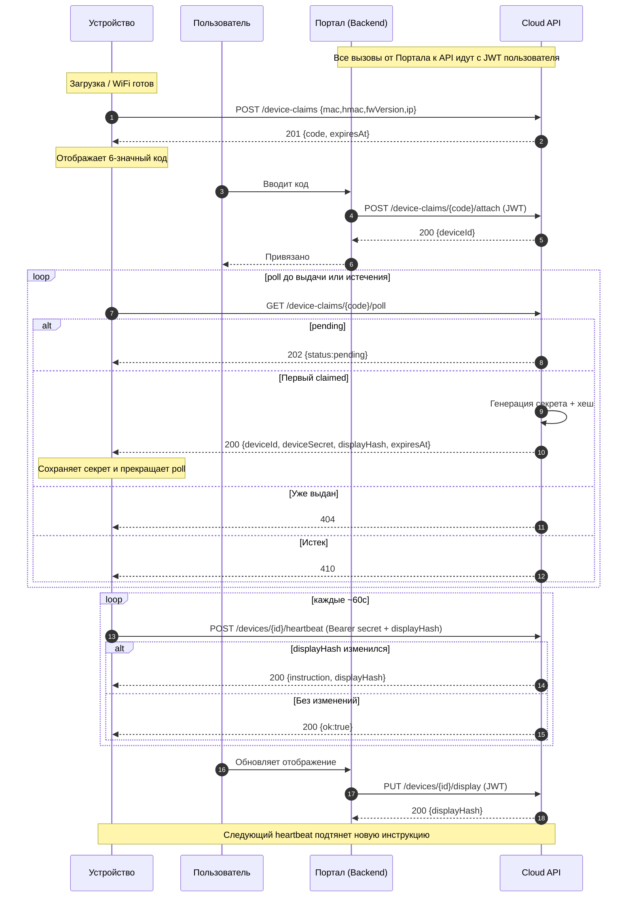
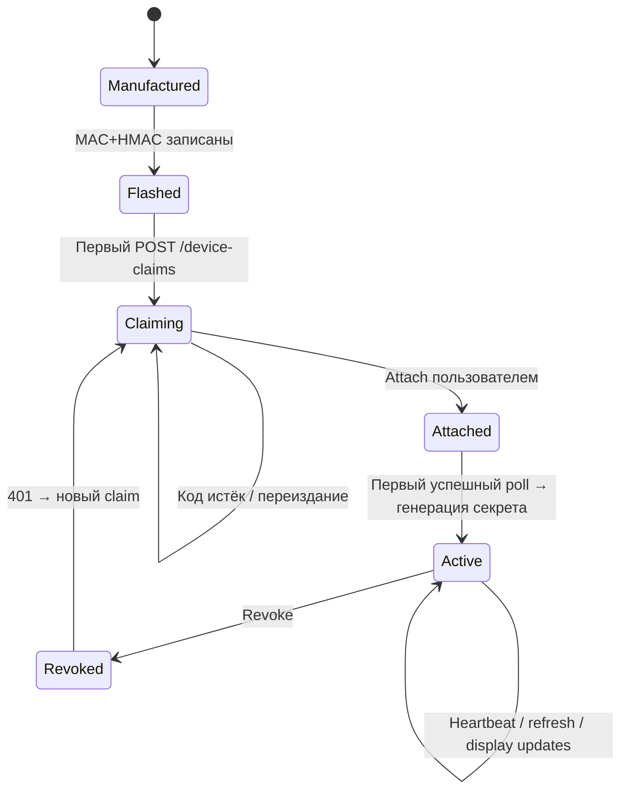

# TigerMeter

## Quick Links

- **Flash Firmware**: https://rd1-io.github.io/tigermeter-api/
- **API Docs**: `docs/overview.md`

## Основные команды

```bash
make setup            # Установить зависимости и настроить БД
make dev              # Запустить API локально
make emulator         # Запустить web-emulator
make prod             # Собрать и прошить firmware
make deploy m="msg"   # Закоммитить и запушить все изменения
make firmware-release # Релиз прошивки + обновление Fly.io
```

## Прошивка устройства

### Через браузер (рекомендуется)
Откройте https://rd1-io.github.io/tigermeter-api/ и следуйте инструкциям.

### Через PlatformIO
```bash
make prod           # Собрать и прошить
make prod-build     # Только собрать
make firmware-release  # Собрать, запушить и обновить Fly.io
```

## OTA обновления

Устройство автоматически проверяет обновления:
- Первая проверка через 60 секунд после старта
- Последующие проверки каждый час

Управление через Admin Panel (колонка Auto-Update).

---

## Экраны устройства

### Основной Экран


### Экран 1: Приветствие / Wi‑Fi Setup


### Экран 2: Код привязки (Claim)


### Экран 3: Низкий заряд батареи


### Экран 4: Нет сети


### Поля отображения
- (1) symbol — короткий идентификатор
- (2) topLine — верхняя строка текста, или дата/время если `topLineShowDate=true`
- (3) mainText — основной текст по центру с настраиваемым размером
- (4) bottomLine — нижняя строка текста
- (5) ledColor / trend bar — динамическая полоса или LED (green/red/purple/blue/yellow)

### Flow экранов
Welcome → Claim Code → (Low Battery / No Network как межсостояния) → Main Display. LED пульсирует на первых двух экранах, затем заменяется столбцом тренда. Low Battery полностью перекрывает контент. No Network сохраняет последние данные (монохром).

---

## Документация

Дополнительно к этому README доступны структурированные файлы:
- `docs/overview.md` — обзор, иерархия источников истины, быстрый старт
- `docs/claim-flow.md` — детальный flow привязки и одноразовой выдачи секрета
- `docs/errors.md` — каталог типовых ошибок и обработка на клиенте


---

## Содержание

- [Этапы](#этапы)
- [Ключевые принципы](#ключевые-принципы)
  - [Диаграмма: Основной flow (Claim → Attach → Poll → Heartbeat)](#диаграмма-основной-flow-claim--attach--poll--heartbeat)
  - [Примечание по Revoke и Refresh](#примечание-по-revoke-и-refresh)
  - [1. Device Claim](#1-device-claim)
  - [2. User Attach](#2-user-attach)
  - [3. Poll + Одноразовая выдача секрета](#3-poll--одноразовая-выдача-секрета)
  - [4. Работа устройства после авторизации](#4-работа-устройства-после-авторизации)
  - [5. Жизненный цикл секрета](#5-жизненный-цикл-секрета)
  - [6. State Machine](#6-state-machine)
  - [7. Display Instruction (формат)](#7-display-instruction-формат)
  - [8. Безопасность привязки (HMAC)](#8-безопасность-привязки-hmac)
  - [9. Ошибки (единый формат)](#9-ошибки-единый-формат)
- [Процесс и параметры отображения](#процесс-и-параметры-отображения)
  - [Flow обновления отображения](#flow-обновления-отображения)
  - [Поля инструкции отображения](#поля-инструкции-отображения)
  - [Правила формирования `hash`](#правила-формирования-hash)
  - [Идемпотентность обновлений](#идемпотентность-обновлений)
  - [Безопасность](#безопасность)
- [Телеметрия устройства и собираемые данные](#телеметрия-устройства-и-собираемые-данные)
  - [Источники телеметрии](#источники-телеметрии)
  - [Поля, которые устройство отправляет](#поля-которые-устройство-отправляет)
  - [Поля, которые портал/бэкенд хранит или выводит](#поля-которые-порталбэкенд-хранит-или-выводит)
  - [Использование телеметрии порталом](#использование-телеметрии-порталом)

---

## Этапы
1. Device Claim (устройство просит код)
2. User Attach (пользователь подтверждает владение кодом)
3. Lazy Secret Issue (устройство получает секрет при первом poll после attach)
4. Authenticated Operation (heartbeat + получение/обновление отображения)
5. Secret Refresh / Revoke (жизненный цикл секрета)

## Ключевые принципы
- Секрет не создаётся при привязке пользователем — только при первом успешном poll устройства (ленивая одноразовая выдача).
- Plaintext секрета никогда не хранится на сервере; хранится только хеш (argon2id/bcrypt).
- Повторное раскрытие секрета запрещено (последующие poll → 404/410).
- Ротация по запросу устройства с перекрытием (~5 мин) + автоматическое истечение (90 дней, refresh ≥ 75%).
- Отзыв (revoke) немедленно инвалидирует текущий секрет; устройство возвращается к стадии claim.

### Диаграмма: Основной flow (Claim → Attach → Poll → Heartbeat)


### Примечание по Revoke и Refresh
Refresh выполняется устройством через `POST /devices/{id}/secret/refresh` (Bearer секрет). Портал не должен получать plaintext новый секрет (минимизация поверхности утечки). Revoke инициируется пользователем через JWT: `POST /devices/{id}/revoke`.

### 1. Device Claim
`POST /device-claims` { mac, hmac, firmwareVersion, ip } (operationId: issueClaimCode)
→ Выдаёт 6‑значный код (TTL ~5 мин). Повторный запрос до истечения может переиспользовать код.

### 2. User Attach
`POST /device-claims/{code}/attach` (JWT пользователя) (operationId: attachClaimCode)
→ Связывает устройство с userId, переводит claim в статус claimed. Секрет НЕ создаётся.

### 3. Poll + Одноразовая выдача секрета
`GET /device-claims/{code}/poll` (без аутентификации) (operationId: pollClaimCode)
- pending → 202 {status}
- first claimed (секрет ещё не выдан) → генерация 32 байт, сохранение хеша, ответ 200 {deviceId, deviceSecret, displayHash, expiresAt}
- subsequent polls → 404
- expired → 410

Формат секрета: префикс ds_, длина 64 символа (32 байта base64/алфавит). Пример: ds_1a2b…

### 4. Работа устройства после авторизации
Bearer Authorization: секрет устройства.

Основные эндпоинты:
- `POST /devices/{id}/heartbeat` {battery, rssi, ip, fwVersion, uptime, displayHash} (operationId: heartbeat)
    - Валидация секрета → обновление телеметрии → сравнение displayHash
    - Если hash отличается: возвращается {instruction, displayHash}; иначе {ok:true}
    - Возвращает `demoMode` и `autoUpdate` флаги для управления устройством
- `GET /devices/{id}/display/hash` → быстрый опрос хеша (operationId: getDisplayHash)
- `GET /devices/{id}/display/full` → получение инструкции при изменении (operationId: getDisplayInstruction)
- `POST /devices/{id}/secret/refresh` → выдаёт новый секрет (старый действует ещё ~5 мин) (operationId: refreshSecret)
- `POST /devices/{id}/revoke` (JWT) → немедленный отзыв (следующий запрос устройства даст 401) (operationId: revokeDevice)

### 5. Жизненный цикл секрета
- TTL: 90 дней
- Refresh разрешён c 75% срока (≥ день 68)
- Перекрытие: старый секрет валиден короткое окно (константа, например 5 мин)
- Revoke: немедленная инвалидация (heartbeat → 401 → устройство инициирует новый claim)
Примечание: Единственный допустимый источник plaintext нового секрета — ответ на device-initiated `POST /devices/{id}/secret/refresh`.

### 6. State Machine


### 7. Display Instruction (формат)
Хеш: канонический JSON (рекурсивно отсортированные ключи) → SHA-256 hex, префикс sha256:.

Пример:
```json
{
  "version": 12,
  "hash": "sha256:...",
  "symbol": "BTC",
  "mainText": "$98,500",
  "topLine": "Bitcoin",
  "topLineFontSize": "small",
  "topLineAlign": "center",
  "mainTextFontSize": "large",
  "mainTextAlign": "center",
  "bottomLine": "+2.5%",
  "bottomLineFontSize": "small",
  "ledColor": "green",
  "ledBrightness": "mid"
}
```

### 8. Безопасность привязки (HMAC)
HMAC_SHA256(device_hmac_key, mac || firmwareVersion || timestampRoundedToMinute)
- Проверка дрейфа времени (≤2 мин)
- Защита от повторов (dedupe по (mac,timestamp) или nonce)

### 9. Ошибки (единый формат)
{"message":"..."}
- 401 Invalid / expired / missing secret
- 404 Повторный poll после выдачи
- 410 Claim expired

## Процесс и параметры отображения

### Flow обновления отображения
1. Пользователь через портал вызывает `PUT /devices/{id}/display` с новой инструкцией.
2. Backend пересчитывает канонический JSON и SHA-256 → `displayHash` и сохраняет версию (version++).
3. Устройство на очередном `POST /devices/{id}/heartbeat` отправляет свой известный `displayHash`.
4. Если хеш отличается — возвращается новая инструкция (inline) или минимальный ответ с `instruction` и новым `displayHash`.
5. Устройство применяет инструкцию и начинает показывать, переходя в steady-state пока хеш не изменится.

Опционально устройство может использовать:
- `GET /devices/{id}/display/hash` для дешёвого опроса (проверка только хеша).
- `GET /devices/{id}/display/full?ifHash=...` чтобы получить полный объект, если изменился.

### Поля инструкции отображения
Метаданные:
- `version`: монотонно растущая версия для конкретного устройства.
- `hash`: `sha256:<hex>` хеш канонического JSON.
- `extensions`: произвольные будущие расширения (обе стороны должны игнорировать неизвестные поля).

Поля отображения:
- `symbol` (обязательно): короткий идентификатор (тикер).
- `mainText` (обязательно): основной текст по центру.
- `topLine`: текст верхней строки.
- `topLineFontSize`: enum `small|mid|large` (по умолчанию `small`).
- `topLineAlign`: enum `left|center|right` (по умолчанию `center`).
- `topLineShowDate`: boolean — показывать текущее время вместо topLine.
- `mainTextFontSize`: enum `small|mid|large` (по умолчанию `large`).
- `mainTextAlign`: enum `left|center|right` (по умолчанию `center`).
- `bottomLine`: текст нижней строки.
- `bottomLineFontSize`: enum `small|mid|large` (по умолчанию `small`).
- `bottomLineAlign`: enum `left|center|right` (по умолчанию `center`).
- `ledColor`: enum `blue|green|red|yellow|purple` (подсветка, по умолчанию `green`).
- `ledBrightness`: enum `off|low|mid|high` (по умолчанию `mid`).
- `beep`: boolean — однократный звуковой сигнал (one-time).
- `flashCount`: int — количество вспышек LED (one-time).
- `refreshInterval`: int — интервал опроса API в секундах (по умолчанию 30).
- `extensions`: future-proof контейнер для расширений.

### Правила формирования `hash`
1. Строим объект инструкции (включая вложенные объекты) с отсортированными ключами (канонический JSON).
2. Сериализуем без лишних пробелов.
3. Вычисляем SHA-256 → hex.
4. Префиксируем `sha256:`.

### Идемпотентность обновлений
Если портал повторно отправляет идентичную инструкцию (ключевая структура и значения не изменились) — `hash` совпадёт, версия МОЖЕТ остаться прежней (реализация) либо быть инкрементирована; устройство ориентируется на `hash` как источник истины для необходимости обновления.

### Безопасность
- Инструкция не содержит чувствительных данных — может кэшироваться plaintext.
- Валидация типов/диапазонов на устройстве (defensive) чтобы игнорировать потенциально некорректные поля из будущих расширений.

## Телеметрия устройства и собираемые данные

### Источники телеметрии
Телеметрия поступает в API главным образом из `POST /devices/{id}/heartbeat`. Дополнительно некоторые атрибуты фиксируются при `claim`.

### Поля, которые устройство отправляет
- `battery` (int %) — заряд батареи.
- `rssi` (int) — уровень сигнала Wi-Fi.
- `ip` (string) — внешний локальный IP, по которому устройство себя видит (диагностика сети).
- `firmwareVersion` — версия прошивки (обновляется при каждом heartbeat или claim).
- `uptimeSeconds` — аптайм на момент heartbeat.
- `displayHash` — хеш инструкции, который устройство считает текущим.

### Поля, которые портал/бэкенд хранит или выводит
- `mac` — MAC, получен при `claim`.
- `userId` — владелец.
- `status` — `awaiting_claim|active|revoked`.
- `lastSeen` — timestamp последнего успешного heartbeat.
- `secretExpiresAt` — когда истечёт текущий секрет.
- `deviceSecretHash` (только админ) — хеш секрета (никогда не plaintext).
- `currentDisplayType` — тип последней инструкции.
- `displayHash` — последний сохранённый хеш.
- `autoUpdate` — включено ли автообновление.
- `demoMode` — включён ли демо режим.

### Использование телеметрии порталом
- Отображение состояния онлайн / офлайн (`lastSeen` > threshold → offline).
- Показ заряда батареи и сигнала.
- Диагностика при support (MAC, fwVersion, RSSI).

---

## Локальный запуск API (Node/Fastify) и примеры curl

- **Старт локально**:
```bash
make setup
make dev
```
- **Health**:
```bash
curl -s http://127.0.0.1:3001/healthz
```

- **Переменные окружения для примеров**:
```bash
export BASE=http://127.0.0.1:3001
export JWT_SECRET=change-me-dev
# Сгенерировать user JWT (role=user)
export USER_TOKEN=$(node -e "import('jose').then(async ({SignJWT})=>{const k=new TextEncoder().encode(process.env.JWT_SECRET);const t=await new SignJWT({sub:'user1',role:'user'}).setProtectedHeader({alg:'HS256'}).sign(k);console.log(t);})")
# Сгенерировать admin JWT (role=admin)
export ADMIN_TOKEN=$(node -e "import('jose').then(async ({SignJWT})=>{const k=new TextEncoder().encode(process.env.JWT_SECRET);const t=await new SignJWT({sub:'admin1',role:'admin'}).setProtectedHeader({alg:'HS256'}).sign(k);console.log(t);})")
```

- **1) Device Claim: запрос кода**:
```bash
CODE=$(curl -s "$BASE/api/device-claims" \
  -H 'content-type: application/json' \
  -d '{"mac":"AA:BB:CC:DD:EE:FF","firmwareVersion":"1.0.0"}' | jq -r .code)
echo "CODE=$CODE"
```

- **2) User Attach: привязать код к пользователю (JWT)**:
```bash
curl -s "$BASE/api/device-claims/$CODE/attach" \
  -H "authorization: Bearer $USER_TOKEN" \
  -X POST
```

- **3) Poll: устройство получает секрет (одноразово)**:
```bash
CLAIM=$(curl -s "$BASE/api/device-claims/$CODE/poll")
echo "$CLAIM" | jq .
DID=$(echo "$CLAIM" | jq -r .deviceId)
DEVSECRET=$(echo "$CLAIM" | jq -r .deviceSecret)
echo "DID=$DID"
echo "DEVSECRET=$DEVSECRET"
```

- **4) Device Heartbeat (Bearer: секрет устройства)**:
```bash
curl -s "$BASE/api/devices/$DID/heartbeat" \
  -H "authorization: Bearer $DEVSECRET" \
  -H 'content-type: application/json' \
  -d '{"battery":95,"rssi":-55,"displayHash":""}' | jq .
```

- **5) Portal: установить инструкцию отображения**:
```bash
curl -s "$BASE/api/devices/$DID/display" \
  -H "authorization: Bearer $USER_TOKEN" \
  -H 'content-type: application/json' \
  -X PUT \
  -d '{
    "version":1,
    "hash":"sha256:draft",
    "symbol":"BTC",
    "mainText":"$98,500",
    "topLine":"Bitcoin",
    "bottomLine":"+2.5%",
    "ledColor":"green"
  }' | jq .
```

- **6) Device: получить текущий хеш**:
```bash
curl -s "$BASE/api/devices/$DID/display/hash" \
  -H "authorization: Bearer $DEVSECRET" | jq .
```

- **7) Device: получить полную инструкцию (304 если не изменилась)**:
```bash
HASH=$(curl -s "$BASE/api/devices/$DID/display/hash" -H "authorization: Bearer $DEVSECRET" | jq -r .hash)
# Попытка получить полную с ifHash (может вернуть 304)
curl -i "$BASE/api/devices/$DID/display/full?ifHash=$HASH" \
  -H "authorization: Bearer $DEVSECRET"
```

- **8) Device: обновить секрет (refresh)**:
```bash
REFRESH=$(curl -s "$BASE/api/devices/$DID/secret/refresh" -H "authorization: Bearer $DEVSECRET" -X POST)
echo "$REFRESH" | jq .
NEWSECRET=$(echo "$REFRESH" | jq -r .deviceSecret)
```

- **9) Portal: список/детали/отвязка устройства**:
```bash
curl -s "$BASE/api/devices" -H "authorization: Bearer $USER_TOKEN" | jq .
curl -s "$BASE/api/devices/$DID" -H "authorization: Bearer $USER_TOKEN" | jq .
curl -s "$BASE/api/devices/$DID/revoke" -H "authorization: Bearer $USER_TOKEN" -X POST | jq .
```

- **10) Admin: список устройств / принудительный revoke / проверка кода**:
```bash
curl -s "$BASE/api/admin/devices" -H "authorization: Bearer $ADMIN_TOKEN" | jq .
curl -s "$BASE/api/admin/devices/$DID/revoke" -H "authorization: Bearer $ADMIN_TOKEN" -X POST | jq .
curl -s "$BASE/api/admin/device-claims/$CODE" -H "authorization: Bearer $ADMIN_TOKEN" | jq .
```

- **11) Admin: изменить настройки устройства (demoMode, autoUpdate)**:
```bash
# Включить Demo Mode
curl -s "$BASE/api/admin/devices/$DID/settings" \
  -H "authorization: Bearer $ADMIN_TOKEN" \
  -H 'content-type: application/json' \
  -X PATCH \
  -d '{"demoMode":true}' | jq .

# Выключить Auto-Update
curl -s "$BASE/api/admin/devices/$DID/settings" \
  -H "authorization: Bearer $ADMIN_TOKEN" \
  -H 'content-type: application/json' \
  -X PATCH \
  -d '{"autoUpdate":false}' | jq .
```

- **12) Admin: factory reset / удаление устройства**:
```bash
# Удалённый Factory Reset (устройство сбросится при следующем heartbeat)
curl -s "$BASE/api/admin/devices/$DID/factory-reset" \
  -H "authorization: Bearer $ADMIN_TOKEN" \
  -X POST | jq .

# Удалить устройство из БД
curl -s "$BASE/api/admin/devices/$DID" \
  -H "authorization: Bearer $ADMIN_TOKEN" \
  -X DELETE | jq .
```

- **13) Admin: управление pending устройствами**:
```bash
# Список устройств ожидающих одобрения
curl -s "$BASE/api/admin/pending-devices" \
  -H "authorization: Bearer $ADMIN_TOKEN" | jq .

# Одобрить устройство (создаёт Device запись)
curl -s "$BASE/api/admin/pending-devices/$PENDING_ID/approve" \
  -H "authorization: Bearer $ADMIN_TOKEN" \
  -X POST | jq .

# Отклонить устройство
curl -s "$BASE/api/admin/pending-devices/$PENDING_ID/reject" \
  -H "authorization: Bearer $ADMIN_TOKEN" \
  -X POST | jq .
```

Примечания:
- Хеш инструкции вычисляется на бэкенде (канонический JSON → SHA-256), поле `hash` в теле запроса может быть любым/черновым.
- Для простоты примеров используется SQLite (`node-api/dev.db`) и секрет JWT по умолчанию `change-me-dev` (см. `make setup`). В проде замените секрет и СУБД.


### Postman коллекция (альтернатива curl)

- Импортируйте файлы из директории `postman/`:
  - `postman/TigerMeter.collection.json`
  - `postman/TigerMeter.local.postman_environment.json`
- Выберите окружение "TigerMeter Local" и нажмите "Auth / Generate User Token", затем "Auth / Generate Admin Token" — это заполнит переменные `userToken` и `adminToken`.
- Выполняйте запросы по порядку: Issue Claim → Attach → Poll → Heartbeat → Set Display → Get Hash/Full → Refresh → Portal/Admin.
- Переменные (`claimCode`, `deviceId`, `deviceSecret`, `displayHash`) будут сохраняться автоматически между запросами.
