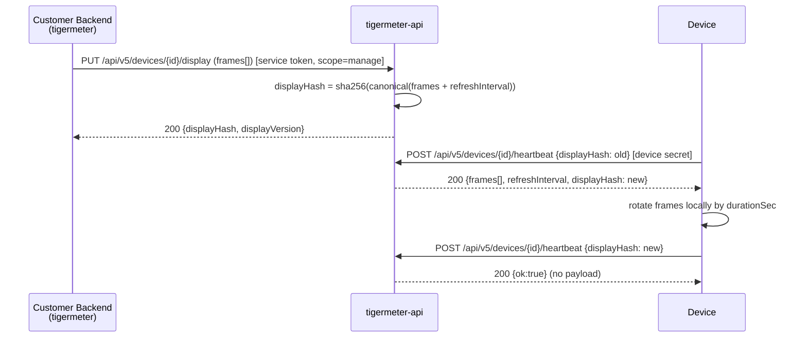

# TigerMeter

Pure frame-delivery gateway: a thin microservice that pushes pre-rendered 1-bit bitmaps to e-paper devices. The service knows nothing about tickers, quotes, fonts, or layout — the customer backend renders the content.

## Quick Links

- **Flash Firmware**: https://rd1-io.github.io/tigermeter-api/
- **API Docs**: `docs/overview.md`
- **Swagger**: `swagger.ru.yaml`
- **Web Admin**: web-emulator (Vite/React app, replaces old web-emulator)

## Основные команды

```bash
make setup            # Установить зависимости и настроить БД
make dev              # Запустить API локально
make emulator         # Запустить web-emulator (web admin)
make prod             # Собрать и прошить firmware
make deploy m="msg"   # Коммит + push (деплой на прод делает GitHub Actions)
make firmware-release # Собрать прошивку, запушить (версия на проде обновится через GitHub Actions)
```

## Концепция (v5)

- **Customer backend** (`tigermeter` — single tenant) pushes **frames**: pre-rendered 1-bit bitmaps via service-token auth.
- **Device** pulls frames on heartbeat, **rotates them locally** by per-frame `durationSec`.
- **Web admin** (this repo) is an **ops + demo tool** for the firmware author: fleet overview, pending approve, frame editor for testing. The customer builds their own admin on top of the same API.
- Partial update: one `displayHash` over the canonical frame payload; heartbeat returns frames only when hash changed.


```mermaid
sequenceDiagram
    participant Cust as Customer Backend<br/>(tigermeter)
    participant API as tigermeter-api
    participant Device
    Cust->>API: PUT /api/v5/devices/{id}/display (frames[])  [service token, scope=manage]
    API->>API: displayHash = sha256(canonical(frames + refreshInterval))
    API-->>Cust: 200 {displayHash, displayVersion}
    Device->>API: POST /api/v5/devices/{id}/heartbeat {displayHash: old}  [device secret]
    API-->>Device: 200 {frames[], refreshInterval, displayHash: new}
    Device->>Device: rotate frames locally by durationSec
    Device->>API: POST /api/v5/devices/{id}/heartbeat {displayHash: new}
    API-->>Device: 200 {ok:true}  (no payload)
```

## Display resolution

Confirmed `GDEY029T71H` = **384x168 landscape mono**. One frame = 384*168/8 = **8064 bytes** packed 1-bit; ~10.7 KB as base64. Cap frame count at **8** to bound ESP32 RAM (~64 KB for 8 raw frames).

## API v5

All routes are prefixed with **`/api/v5/`**. Old unversioned routes were removed in the same deploy (no legacy support needed — no production users yet).

### Display payload (PUT /api/v5/devices/:id/display)

```json
{
  "frames": [
    {
      "bitmap": "base64-8064-bytes",
      "ledColor": "green",
      "ledBrightness": "mid",
      "durationSec": 30,
      "beep": false,
      "flashCount": 0
    }
  ],
  "refreshInterval": 60
}
```

- `bitmap`: packed 1-bit 384x168, row-major, MSB-first (1=white, 0=black). Device draws full-screen, no composition.
- `ledColor` / `ledBrightness` / `durationSec` / `beep` / `flashCount` are **per-frame**.
- `refreshInterval`: heartbeat cadence in seconds.

#### Validation rules (PUT)

Server rejects with 400 if any of:
- `frames` missing, not an array, length `0` or `> 8`
- any `bitmap` invalid base64 or decodes to ≠ **8064 bytes**
- `durationSec` not integer or outside `1..86400`
- `refreshInterval` not integer or outside `10..3600`
- `ledColor` not in `{green, red, blue, yellow, cyan, magenta, white, rainbow, off}`
- `ledBrightness` not in `{low, mid, high, off}`
- `flashCount` not integer or outside `0..10`
- `beep` not boolean

Unknown keys are **rejected** (`z.strict()`).

#### Hash semantics

`displayHash = "sha256:" + hex( sha256( canonical(frames + refreshInterval) ) )` where `canonical` = recursive sorted-keys JSON (see `displayPayloadHash` in `node-api/src/utils/crypto.ts`).

**Hash includes one-shot fields (`beep`, `flashCount`).** No strip logic. If the customer wants to re-beep, they PUT the same frames with `beep:true` again — this produces a new hash, device re-downloads, beeps, and treats one-shot fields as consumed locally. Cost: one extra ~10KB-per-frame download per re-beep.

### Auth model

#### Service tokens (env config, no DB)

```bash
# .env
SERVICE_TOKENS='[
  {"token":"sk-ops-XXX",     "tenantId":"ops",       "scope":"ops"},
  {"token":"sk-tigermeter-YYY","tenantId":"tigermeter","scope":"manage"}
]'
```

- Loaded at boot in `node-api/src/config.ts` via zod; fail-fast on parse error.
- `requireService(request)` reads `Authorization: Bearer <token>`, looks up in the list, attaches `request.serviceAuth = { tenantId, scope }`.
- Two scopes:
  - **`ops`** — full access: all devices regardless of tenant, pending approve/reject, factory reset, delete, settings, view frames of any device (for debugging).
  - **`manage`** — scoped to own tenant: CRUD on devices where `Device.tenantId = <tenant>`, PUT display, PATCH settings. Cannot see other tenants' devices (404, not 403 — don't leak existence).

Since there's exactly one tenant (`tigermeter`) today, the implementation uses plain string equality on `tenantId`. The schema already supports a second customer.

#### Device auth

`requireDevice` (device-secret JWT) unchanged.

#### User JWT — REMOVED

`requireUser` / `requireAdmin` decorators are deleted. The admin UI logs in with a service token directly (paste-once, stored in localStorage). There are no human users of this API — only services.

### Claim flow (device generates code, tenant attaches)

```
1. Device powers on, no WiFi credentials → AP mode + captive portal
2. User configures WiFi via captive portal (unchanged)
3. Device calls POST /api/v5/device-claims {mac, firmwareVersion, hmac} → gets {code, expiresAt}
4. Device displays the 6-digit code on e-ink (unchanged)
5. End user enters the code in the customer's app
6. Customer backend calls:
     POST /api/v5/device-claims/:code/attach
     Authorization: Bearer <tigermeter-token>
     Body: {"externalUserId": "their-internal-user-id"}
7. Server validates code, binds device:
     Device.tenantId = "tigermeter"  (from service token)
     Device.externalUserId = "their-internal-user-id"
     Device.status = "active"
8. Device polls claim status on next heartbeat (or GET /device-claims/:code/poll), sees "claimed", stops showing code
9. Customer pushes first frames → device shows content
```

**Composite ownership key:** `Device` has `tenantId` (from service token) + `externalUserId` (opaque string from customer). Tenant-scoped queries filter `WHERE tenantId = ?`. The `externalUserId` is purely informational and shows up in ops admin for debugging.

**Rate limit:** `POST /device-claims/:code/attach` gets a strict rate limit (5 attempts/minute per IP) to prevent 6-digit brute force. Codes expire after 15 minutes.

## Прошивка устройства

### Через браузер (рекомендуется)
Откройте https://rd1-io.github.io/tigermeter-api/ и следуйте инструкциям.

### Через PlatformIO
```bash
make prod           # Собрать и прошить
make prod-build     # Только собрать
make firmware-release  # Собрать прошивку и запушить (версия на проде обновится через GitHub Actions)
```

## OTA обновления

Устройство автоматически проверяет обновления:
- Первая проверка через 60 секунд после старта
- Последующие проверки каждый час

Управление через Web Admin (колонка Auto-Update).

## Деплой на прод (GitHub Actions)

Деплой автоматизирован через GitHub Actions (`.github/workflows/deploy.yml`):

- **Триггеры**: push в `main` (по путям `node-api/**`, `web-emulator/**`, `firmware/**`, `Makefile`, `deploy/**`) или ручной запуск (`workflow_dispatch`).
- **Что делает**: собирает web admin (`VITE_API_BASE_URL=https://api-tiger.rd1.io`), пакует `node-api`, доставляет на прод-сервер (PVE → LXC CT 104 → docker compose `/opt/gateway`), пересобирает образ API, перезапускает стек и проверяет health.
- **`LATEST_FIRMWARE_VERSION`**: обновляется на сервере автоматически из `firmware/version_prod.txt` при каждом деплое (не нужно вручную ходить по SSH).

Доступ к проду настроен через GitHub secrets (см. репозиторий → Settings → Secrets): `PVE_HOST`, `PVE_PORT`, `PVE_USER`, `PVE_SSH_KEY`.

Локально ничего настраивать не нужно — просто пушите в `main`.

## Экраны устройства

### Системные экраны (firmware-rendered, text)
- Приветствие / Wi-Fi Setup (captive portal)
- Код привязки (Claim)
- Низкий заряд батареи
- Нет сети / Reconnecting
- "Waiting for content" — до первого PUT /display

### Основной контент
Полностью bitmap-кадры, присылаемые с сервера. Устройство не рендерит текст/логотипы на основном экране — только рисует 1-bit bitmap полный экран и крутит кадры по `durationSec`.

## Web Admin (web-emulator)

Replaces the old web-emulator. Ops + demo tool: fleet management + frame editor for testing.

### Auth
- `/login` — paste service token (stored in localStorage). Server exposes `GET /api/v5/admin/me` → `{tenantId, scope}`.
- No user JWT anywhere.

### Routes / views
- `/devices` — all devices (ops). Columns: name, mac, tenantId, externalUserId, status, lastSeen, battery, firmwareVersion, displayHash, displayVersion. Row click → device detail.
- Device detail — tabs: **Overview** (telemetry, name edit, autoUpdate/demoMode toggles, revoke/factory-reset/delete), **Frames** (editor), **Activity** (heartbeat log polling).
- `/pending` — approve/reject. Approve modal asks for `tenantId` (default `"tigermeter"`).
- `/settings` — auto-provision toggle.

### Frame editor
- Canvas 384x168, 1-bit, 2x nearest-neighbor scale.
- Tools: pencil, eraser, fill, clear, invert. PNG import → client-side resize + Floyd-Steinberg dithering.
- Frame list (up to 8): per-frame `durationSec`, `ledColor`, `ledBrightness`, `beep`, `flashCount`; reorder; duplicate; delete.
- Preview: plays rotation at real speed.
- Save: convert canvases → packed base64 → build payload → PUT `/api/v5/devices/:id/display`.
- Load current: GET `/api/v5/admin/devices/:id/display` (ops only).

## Документация

- `docs/overview.md` — обзор, иерархия источников истины, быстрый старт
- `docs/claim-flow.md` — детальный flow привязки и одноразовой выдачи секрета
- `docs/errors.md` — каталог типовых ошибок и обработка на клиенте
- `swagger.ru.yaml` — формальная OpenAPI спецификация

## Локальный запуск API (Node/Fastify) и примеры curl

- **Старт локально**:
```bash
make setup
make dev
```
- **Health**:
```bash
curl -s http://127.0.0.1:3001/healthz
```

- **Переменные окружения для примеров**:
```bash
export BASE=http://127.0.0.1:3001
export SERVICE_TOKEN=sk-tigermeter-XXX   # scope=manage (см. SERVICE_TOKENS в .env)
export OPS_TOKEN=sk-ops-XXX              # scope=ops
```

- **1) Device Claim: запрос кода** (HMAC-подпись обычно генерирует прошивка):
```bash
CODE=$(curl -s "$BASE/api/v5/device-claims" \
  -H 'content-type: application/json' \
  -d '{"mac":"AA:BB:CC:DD:EE:FF","firmwareVersion":"v36"}' | jq -r .code)
echo "CODE=$CODE"
```

- **2) Tenant Attach: привязать код (service token, scope=manage)**:
```bash
curl -s "$BASE/api/v5/device-claims/$CODE/attach" \
  -H "authorization: Bearer $SERVICE_TOKEN" \
  -H 'content-type: application/json' \
  -X POST \
  -d '{"externalUserId":"user-12345"}' | jq .
```

- **3) Poll: устройство получает секрет (одноразово)**:
```bash
CLAIM=$(curl -s "$BASE/api/v5/device-claims/$CODE/poll")
echo "$CLAIM" | jq .
DID=$(echo "$CLAIM" | jq -r .deviceId)
DEVSECRET=$(echo "$CLAIM" | jq -r .deviceSecret)
echo "DID=$DID"
```

- **4) Device Heartbeat (Bearer: секрет устройства)**:
```bash
curl -s "$BASE/api/v5/devices/$DID/heartbeat" \
  -H "authorization: Bearer $DEVSECRET" \
  -H 'content-type: application/json' \
  -d '{"battery":95,"rssi":-55,"displayHash":""}' | jq .
```

- **5) Portal: установить bitmap-кадры**:
```bash
# Сгенерируем пустой кадр 8064 байт (0x00) в base64
BITMAP=$(node -e "console.log(Buffer.alloc(8064).toString('base64'))")
curl -s "$BASE/api/v5/devices/$DID/display" \
  -H "authorization: Bearer $SERVICE_TOKEN" \
  -H 'content-type: application/json' \
  -X PUT \
  -d "{
    \"frames\":[{\"bitmap\":\"$BITMAP\",\"ledColor\":\"green\",\"ledBrightness\":\"mid\",\"durationSec\":30,\"beep\":false,\"flashCount\":0}],
    \"refreshInterval\":60
  }" | jq .
```

- **6) Portal: список/детали/обновление устройства**:
```bash
curl -s "$BASE/api/v5/devices" -H "authorization: Bearer $SERVICE_TOKEN" | jq .
curl -s "$BASE/api/v5/devices/$DID" -H "authorization: Bearer $SERVICE_TOKEN" | jq .
curl -s "$BASE/api/v5/devices/$DID" \
  -H "authorization: Bearer $SERVICE_TOKEN" \
  -H 'content-type: application/json' \
  -X PATCH \
  -d '{"name":"Kitchen","autoUpdate":true,"demoMode":false}' | jq .
```

- **7) Ops Admin (scope=ops)**: список всех устройств, просмотр кадров, approve/reject:
```bash
curl -s "$BASE/api/v5/admin/devices" -H "authorization: Bearer $OPS_TOKEN" | jq .
curl -s "$BASE/api/v5/admin/devices/$DID/display" -H "authorization: Bearer $OPS_TOKEN" | jq .
curl -s "$BASE/api/v5/admin/pending-devices" -H "authorization: Bearer $OPS_TOKEN" | jq .
curl -s "$BASE/api/v5/admin/pending-devices/$PENDING_ID/approve" \
  -H "authorization: Bearer $OPS_TOKEN" \
  -H 'content-type: application/json' \
  -X POST \
  -d '{"tenantId":"tigermeter"}' | jq .
```

- **8) Device: обновить секрет (refresh)**:
```bash
curl -s "$BASE/api/v5/devices/$DID/secret/refresh" -H "authorization: Bearer $DEVSECRET" -X POST | jq .
```

Примечания:
- Хеш кадров вычисляется на бэкенде (`displayPayloadHash`: канонический JSON → SHA-256, префикс `sha256:`). Клиентская часть web admin считает тот же хеш для отображения.
- Для простоты примеров используется SQLite (`node-api/dev.db`). В проде замените секреты в `SERVICE_TOKENS` и HMAC_KEY.
