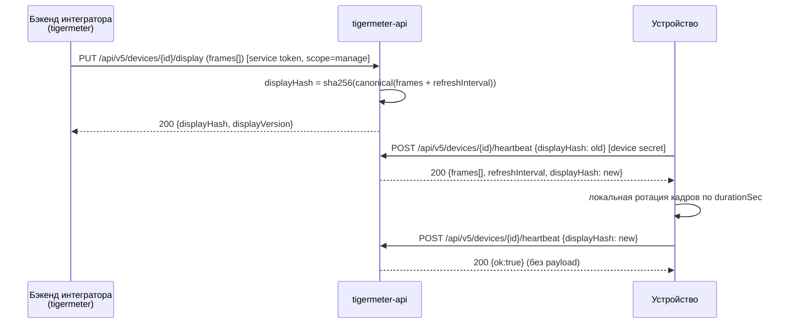

# TigerMeter

Шлюз доставки кадров: тонкий микросервис, который отправляет на e-paper устройства заранее отрендеренные 1-bit bitmap. Сервис не знает о тикерах, котировках, шрифтах и вёрстке — контент рисует бэкенд интегратора.

## Быстрые ссылки

- **Прошивка через браузер**: https://rd1-io.github.io/tigermeter-api/
- **Документация API**: `docs/overview.md`
- **Swagger**: `swagger.ru.yaml`
- **Web Admin**: web-emulator (Vite/React, заменяет старый web-emulator)

## Основные команды

```bash
make setup            # Установить зависимости и настроить БД
make dev              # Запустить API локально
make emulator         # Запустить web-emulator (web admin)
make prod             # Собрать и прошить firmware
make deploy m="msg"   # Коммит + push (деплой на прод делает GitHub Actions)
make firmware-release # Собрать прошивку, запушить (версия на проде обновится через GitHub Actions)
```

## Концепция (v5)

- **Бэкенд интегратора** (`tigermeter` — один tenant) отправляет **кадры**: готовые 1-bit bitmap через service-token auth.
- **Устройство** забирает кадры на heartbeat и **локально крутит** их по `durationSec` каждого кадра.
- **Web admin** (этот репозиторий) — **ops + demo** для автора прошивки: обзор флота, approve pending, редактор кадров для тестов. Интегратор строит свой кабинет поверх того же API.
- Partial update: один `displayHash` на канонический payload кадров; heartbeat отдаёт кадры только при смене hash.


```mermaid
sequenceDiagram
    participant Cust as Бэкенд интегратора<br/>(tigermeter)
    participant API as tigermeter-api
    participant Device as Устройство
    Cust->>API: PUT /api/v5/devices/{id}/display (frames[])  [service token, scope=manage]
    API->>API: displayHash = sha256(canonical(frames + refreshInterval))
    API-->>Cust: 200 {displayHash, displayVersion}
    Device->>API: POST /api/v5/devices/{id}/heartbeat {displayHash: old}  [device secret]
    API-->>Device: 200 {frames[], refreshInterval, displayHash: new}
    Device->>Device: локальная ротация кадров по durationSec
    Device->>API: POST /api/v5/devices/{id}/heartbeat {displayHash: new}
    API-->>Device: 200 {ok:true}  (без payload)
```

## Разрешение экрана

Подтверждено: `GDEY029T71H` = **384×168 landscape mono**. Один кадр = 384×168/8 = **8064 байт** packed 1-bit; ~10.7 KB в base64. Лимит кадров — **8** (ограничение RAM ESP32, ~64 KB на 8 сырых кадров).

## API v5

Все маршруты с префиксом **`/api/v5/`**. Старые неверсионированные маршруты удалены в том же деплое (legacy не нужен — production-пользователей ещё нет).

### Payload display (PUT /api/v5/devices/:id/display)

```json
{
  "frames": [
    {
      "bitmap": "base64-8064-bytes",
      "ledColor": "green",
      "ledBrightness": "mid",
      "durationSec": 30,
      "beep": false,
      "flashCount": 0
    }
  ],
  "refreshInterval": 60
}
```

- `bitmap`: packed 1-bit 384×168, row-major, MSB-first (1=белый, 0=чёрный). Устройство рисует на весь экран, без композиции.
- `ledColor` / `ledBrightness` / `durationSec` / `beep` / `flashCount` — **на каждый кадр**.
- `refreshInterval`: период heartbeat в секундах.

#### Правила валидации (PUT)

Сервер отвечает 400, если:
- `frames` отсутствует, не массив, длина `0` или `> 8`
- любой `bitmap` — невалидный base64 или декодируется не в **8064 байт**
- `durationSec` не целое или вне `1..86400`
- `refreshInterval` не целое или вне `10..3600`
- `ledColor` не из `{green, red, blue, yellow, cyan, magenta, white, rainbow, off}`
- `ledBrightness` не из `{low, mid, high, off}`
- `flashCount` не целое или вне `0..10`
- `beep` не boolean

Неизвестные ключи **отклоняются** (`z.strict()`).

**Тело PUT** содержит только `frames` и `refreshInterval` — `displayHash` и `displayVersion` считает сервер. Ответ: `{ displayHash, displayVersion }`.

#### Семантика hash

`displayHash = "sha256:" + hex( sha256( canonical(frames + refreshInterval) ) )`, где `canonical` = JSON с рекурсивно отсортированными ключами (см. `displayPayloadHash` в `node-api/src/utils/crypto.ts`).

**Hash включает one-shot поля (`beep`, `flashCount`).** Логики strip нет. Чтобы повторить beep, нужен повторный PUT с теми же кадрами и `beep:true` — это новый hash, устройство снова скачивает кадры и локально «потребляет» one-shot поля. Стоимость: ~10 KB на кадр за каждый повторный beep.

### Модель auth

#### Service tokens (env, без БД)

```bash
# .env
SERVICE_TOKENS='[
  {"token":"sk-ops-XXX",     "tenantId":"ops",       "scope":"ops"},
  {"token":"sk-tigermeter-YYY","tenantId":"tigermeter","scope":"manage"}
]'
```

- Загружаются при старте в `node-api/src/config.ts` через zod; fail-fast при ошибке парсинга.
- `requireService(request)` читает `Authorization: Bearer <token>`, ищет в списке, проставляет `request.serviceAuth = { tenantId, scope }`.
- Два scope:
  - **`ops`** — полный доступ: все устройства любого tenant, approve/reject pending, factory reset, delete, settings, просмотр кадров любого устройства (отладка).
  - **`manage`** — только свой tenant: CRUD устройств с `Device.tenantId = <tenant>`, PUT display, PATCH settings. Чужие устройства не видны (404, не 403 — не раскрываем существование).

Сейчас один tenant (`tigermeter`); сравнение по `tenantId` — строковое равенство. Схема уже готова ко второму клиенту.

#### Auth устройства

`requireDevice` (device-secret) без изменений.

#### User JWT — УДАЛЁН

Декораторы `requireUser` / `requireAdmin` удалены. Admin UI логинится service token напрямую (вставить один раз, хранится в localStorage). «Человеческих» пользователей API нет — только сервисы.

### Claim flow (код генерирует устройство, attach делает интегратор)

```
1. Устройство включается, нет WiFi → AP + captive portal
2. Пользователь настраивает WiFi через captive portal (без изменений)
3. Устройство: POST /api/v5/device-claims {mac, firmwareVersion, hmac} → {code, expiresAt}
4. Устройство показывает 6-значный код на e-ink (без изменений)
5. Пользователь вводит код в приложении интегратора
6. Бэкенд интегратора:
     POST /api/v5/device-claims/:code/attach
     Authorization: Bearer <tigermeter-token>
     Body: {"externalUserId": "внутренний-id-пользователя"}
7. Сервер валидирует код, привязывает устройство:
     Device.tenantId = "tigermeter"  (из service token)
     Device.externalUserId = "внутренний-id-пользователя"
     Device.status = "active"
8. Устройство на следующем heartbeat/poll видит "claimed", перестаёт показывать код
9. Интегратор отправляет первые кадры → устройство показывает контент
```

**Составной ключ владения:** у `Device` есть `tenantId` (из service token) + `externalUserId` (opaque строка от клиента). Запросы tenant фильтруют `WHERE tenantId = ?`. `externalUserId` — справочное поле, видно в ops admin для отладки.

**Rate limit:** `POST /device-claims/:code/attach` — строгий лимит (5 попыток/мин/IP) против перебора 6-значного кода. Коды живут **5 минут** (`claimCodeTtlSeconds: 300`).

## Прошивка устройства

### Через браузер (рекомендуется)
Откройте https://rd1-io.github.io/tigermeter-api/ и следуйте инструкциям.

### Через PlatformIO
```bash
make prod           # Собрать и прошить
make prod-build     # Только собрать
make firmware-release  # Собрать прошивку и запушить (версия на проде обновится через GitHub Actions)
```

## OTA обновления

Устройство автоматически проверяет обновления:
- Первая проверка через 60 секунд после старта
- Последующие проверки каждый час

Управление через Web Admin (колонка Auto-Update).

## Деплой на прод (GitHub Actions)

Деплой автоматизирован через GitHub Actions (`.github/workflows/deploy.yml`):

- **Триггеры**: push в `main` (по путям `node-api/**`, `web-emulator/**`, `firmware/**`, `Makefile`, `deploy/**`) или ручной запуск (`workflow_dispatch`).
- **Что делает**: собирает web admin (`VITE_API_BASE_URL=https://api-tiger.rd1.io`), пакует `node-api`, доставляет на прод-сервер (PVE → LXC CT 104 → docker compose `/opt/gateway`), пересобирает образ API, перезапускает стек и проверяет health.
- **`LATEST_FIRMWARE_VERSION`**: обновляется на сервере автоматически из `firmware/version_prod.txt` при каждом деплое (не нужно вручную ходить по SSH).

Доступ к проду настроен через GitHub secrets (см. репозиторий → Settings → Secrets): `PVE_HOST`, `PVE_PORT`, `PVE_USER`, `PVE_SSH_KEY`.

Локально ничего настраивать не нужно — достаточно пушить в `main`.

## Экраны устройства

### Системные экраны (текст, рисует прошивка)
- Приветствие / Wi‑Fi Setup (captive portal)
- Код привязки (Claim)
- Низкий заряд батареи
- Нет сети / Reconnecting
- «Ожидание контента» — до первого PUT /display

### Основной контент
Полностью bitmap-кадры с сервера. На основном экране устройство не рендерит текст и логотипы — только 1-bit bitmap на весь экран и ротация по `durationSec`.

## Web Admin (web-emulator)

Заменяет старый web-emulator. Ops + demo: управление флотом и редактор кадров для тестов.

### Auth
- `/login` — вставить service token (localStorage). Сервер: `GET /api/v5/admin/me` → `{tenantId, scope}`.
- User JWT нигде не используется.

### Маршруты / экраны
- `/devices` — все устройства (ops). Колонки: name, mac, tenantId, externalUserId, status, lastSeen, battery, firmwareVersion, displayHash, displayVersion. Клик по строке → карточка устройства.
- Карточка устройства — вкладки: **Overview** (телеметрия, имя, autoUpdate/demoMode, revoke/factory-reset/delete), **Frames** (редактор), **Activity** (лог heartbeat).
- `/pending` — approve/reject. В модалке approve — `tenantId` (по умолчанию `"tigermeter"`).
- `/settings` — переключатель auto-provision.

### Редактор кадров
- Canvas 384×168, 1-bit, масштаб 2× nearest-neighbor.
- Инструменты: карандаш, ластик, заливка, очистка, инверсия. Импорт PNG → resize на клиенте + Floyd-Steinberg dithering.
- Список кадров (до 8): на каждый — `durationSec`, `ledColor`, `ledBrightness`, `beep`, `flashCount`; reorder, duplicate, delete.
- Preview: ротация в реальном tempo.
- Save: canvas → packed base64 → payload → PUT `/api/v5/devices/:id/display`.
- Load: GET `/api/v5/admin/devices/:id/display` (только ops).

## Документация

- `docs/proposal-display-service.md` — краткое предложение для интегратора (суть подхода)
- `docs/overview.md` — обзор, иерархия источников истины, быстрый старт
- `docs/claim-flow.md` — flow привязки и одноразовой выдачи секрета
- `docs/errors.md` — каталог типовых ошибок и обработка на клиенте
- `swagger.ru.yaml` — формальная OpenAPI-спецификация

## Локальный запуск API (Node/Fastify) и примеры curl

- **Старт локально**:
```bash
make setup
make dev
```
- **Health**:
```bash
curl -s http://127.0.0.1:3001/healthz
```

- **Переменные окружения для примеров**:
```bash
export BASE=http://127.0.0.1:3001
export SERVICE_TOKEN=sk-tigermeter-XXX   # scope=manage (см. SERVICE_TOKENS в .env)
export OPS_TOKEN=sk-ops-XXX              # scope=ops
```

- **1) Device Claim: запрос кода** (HMAC обычно генерирует прошивка):
```bash
CODE=$(curl -s "$BASE/api/v5/device-claims" \
  -H 'content-type: application/json' \
  -d '{"mac":"AA:BB:CC:DD:EE:FF","firmwareVersion":"v36"}' | jq -r .code)
echo "CODE=$CODE"
```

- **2) Attach: привязать код (service token, scope=manage)**:
```bash
curl -s "$BASE/api/v5/device-claims/$CODE/attach" \
  -H "authorization: Bearer $SERVICE_TOKEN" \
  -H 'content-type: application/json' \
  -X POST \
  -d '{"externalUserId":"user-12345"}' | jq .
```

- **3) Poll: устройство получает секрет (одноразово)**:
```bash
CLAIM=$(curl -s "$BASE/api/v5/device-claims/$CODE/poll")
echo "$CLAIM" | jq .
DID=$(echo "$CLAIM" | jq -r .deviceId)
DEVSECRET=$(echo "$CLAIM" | jq -r .deviceSecret)
echo "DID=$DID"
```

- **4) Heartbeat устройства (Bearer: секрет устройства)**:
```bash
curl -s "$BASE/api/v5/devices/$DID/heartbeat" \
  -H "authorization: Bearer $DEVSECRET" \
  -H 'content-type: application/json' \
  -d '{"battery":95,"rssi":-55,"displayHash":""}' | jq .
```

- **5) Отправить bitmap-кадры**:
```bash
# Пустой кадр 8064 байт (0x00) в base64
BITMAP=$(node -e "console.log(Buffer.alloc(8064).toString('base64'))")
curl -s "$BASE/api/v5/devices/$DID/display" \
  -H "authorization: Bearer $SERVICE_TOKEN" \
  -H 'content-type: application/json' \
  -X PUT \
  -d "{
    \"frames\":[{\"bitmap\":\"$BITMAP\",\"ledColor\":\"green\",\"ledBrightness\":\"mid\",\"durationSec\":30,\"beep\":false,\"flashCount\":0}],
    \"refreshInterval\":60
  }" | jq .
```

- **6) Список / детали / обновление устройства**:
```bash
curl -s "$BASE/api/v5/devices" -H "authorization: Bearer $SERVICE_TOKEN" | jq .
curl -s "$BASE/api/v5/devices/$DID" -H "authorization: Bearer $SERVICE_TOKEN" | jq .
curl -s "$BASE/api/v5/devices/$DID" \
  -H "authorization: Bearer $SERVICE_TOKEN" \
  -H 'content-type: application/json' \
  -X PATCH \
  -d '{"name":"Kitchen","autoUpdate":true,"demoMode":false}' | jq .
```

- **7) Ops Admin (scope=ops)**: флот, кадры, approve/reject:
```bash
curl -s "$BASE/api/v5/admin/devices" -H "authorization: Bearer $OPS_TOKEN" | jq .
curl -s "$BASE/api/v5/admin/devices/$DID/display" -H "authorization: Bearer $OPS_TOKEN" | jq .
curl -s "$BASE/api/v5/admin/pending-devices" -H "authorization: Bearer $OPS_TOKEN" | jq .
curl -s "$BASE/api/v5/admin/pending-devices/$PENDING_ID/approve" \
  -H "authorization: Bearer $OPS_TOKEN" \
  -H 'content-type: application/json' \
  -X POST \
  -d '{"tenantId":"tigermeter"}' | jq .
```

- **8) Refresh секрета устройства**:
```bash
curl -s "$BASE/api/v5/devices/$DID/secret/refresh" -H "authorization: Bearer $DEVSECRET" -X POST | jq .
```

Примечания:
- Hash кадров считается на бэкенде (`displayPayloadHash`: канонический JSON → SHA-256, префикс `sha256:`). Web admin считает тот же hash для отображения.
- Для примеров используется SQLite (`node-api/dev.db`). В проде замените секреты в `SERVICE_TOKENS` и `HMAC_KEY`.
