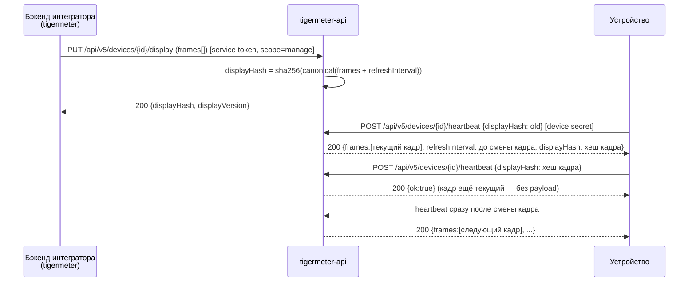

# TigerMeter

Шлюз доставки кадров: тонкий микросервис, который отправляет на e-paper устройства заранее отрендеренные 1-bit bitmap. Сервис не знает о тикерах, котировках, шрифтах и вёрстке — контент рисует бэкенд интегратора.

## Быстрые ссылки

- **Прошивка через браузер**: https://rd1-io.github.io/tigermeter-api/
- **Документация API**: `docs/overview.md`
- **Swagger**: `swagger.ru.yaml`
- **Web Admin**: web-emulator (Vite/React, заменяет старый web-emulator)

## Основные команды

```bash
make setup            # Установить зависимости, создать .env / secrets.ini из примеров, мигрировать локальную БД
make dev              # Запустить API локально (http://127.0.0.1:3001)
make emulator         # Запустить web admin (http://localhost:5175)
make flash            # Собрать и прошить firmware (по WiFi, иначе по USB)
make log              # Serial monitor
make deploy m="msg"   # Коммит + push (деплой на прод делает GitHub Actions)
make firmware-release # Собрать прошивку, запушить (версия на проде обновится через GitHub Actions)
```

## Концепция (v5)

- **Бэкенд интегратора** (`tigermeter` — один tenant) отправляет **кадры**: готовые 1-bit bitmap через service-token auth.
- **Устройство** забирает на heartbeat **один текущий кадр**; набор (до 8 кадров) по `durationSec` **крутит сервер** — см. «Ротация кадров».
- **Web admin** (этот репозиторий) — **ops + demo** для автора прошивки: обзор флота, approve pending, редактор кадров для тестов. Интегратор строит свой кабинет поверх того же API.
- Partial update: один `displayHash` на канонический payload кадров; heartbeat отдаёт кадры только при смене hash.


```mermaid
sequenceDiagram
    participant Cust as Бэкенд интегратора<br/>(tigermeter)
    participant API as tigermeter-api
    participant Device as Устройство
    Cust->>API: PUT /api/v5/devices/{id}/display (frames[])  [service token, scope=manage]
    API->>API: displayHash = sha256(canonical(frames + refreshInterval))
    API-->>Cust: 200 {displayHash, displayVersion}
    Device->>API: POST /api/v5/devices/{id}/heartbeat {displayHash: old}  [device secret]
    API-->>Device: 200 {frames:[текущий кадр], refreshInterval: до смены кадра, displayHash: хеш кадра}
    Device->>API: POST /api/v5/devices/{id}/heartbeat {displayHash: хеш кадра}
    API-->>Device: 200 {ok:true}  (кадр ещё текущий — без payload)
    Device->>API: heartbeat сразу после смены кадра
    API-->>Device: 200 {frames:[следующий кадр], ...}
```

## Разрешение экрана

Подтверждено: `GDEY029T71H` = **384×168 landscape mono**. Один кадр = 384×168/8 = **8064 байт** packed 1-bit; ~10.7 KB в base64. Лимит кадров в наборе — **8**; устройство (ESP32 без PSRAM) держит один кадр, ротацию ведёт сервер.

## API v5

Все маршруты с префиксом **`/api/v5/`**. Старые неверсионированные маршруты удалены в том же деплое (legacy не нужен — production-пользователей ещё нет).

### Payload display (PUT /api/v5/devices/:id/display)

```json
{
  "frames": [
    {
      "bitmap": "base64-8064-bytes",
      "ledColor": "green",
      "ledBrightness": "mid",
      "durationSec": 30,
      "beep": false,
      "flashCount": 0
    }
  ],
  "refreshInterval": 60
}
```

- `bitmap`: packed 1-bit 384×168, row-major, MSB-first (1=белый, 0=чёрный). Устройство рисует на весь экран, без композиции.
- `ledColor` / `ledBrightness` / `durationSec` / `beep` / `flashCount` — **на каждый кадр**.
- `refreshInterval`: максимальный период heartbeat в секундах (при нескольких кадрах сервер назначает интервал до ближайшей смены кадра).

#### Правила валидации (PUT)

Сервер отвечает 400, если:
- `frames` отсутствует, не массив, длина `0` или `> 8`
- любой `bitmap` — невалидный base64 или декодируется не в **8064 байт**
- `durationSec` не целое или вне `1..86400`
- `refreshInterval` не целое или вне `10..3600`
- `ledColor` не из `{green, red, blue, yellow, cyan, magenta, white, rainbow, off}`
- `ledBrightness` не из `{low, mid, high, off}`
- `flashCount` не целое или вне `0..10`
- `beep` не boolean

Неизвестные ключи **отклоняются** (`z.strict()`).

**Тело PUT** содержит только `frames` и `refreshInterval` — `displayHash` и `displayVersion` считает сервер. Ответ: `{ displayHash, displayVersion }`.

#### Семантика hash

`displayHash = "sha256:" + hex( sha256( canonical(frames + refreshInterval) ) )`, где `canonical` = JSON с рекурсивно отсортированными ключами (см. `displayPayloadHash` в `node-api/src/utils/crypto.ts`).

**Hash набора включает one-shot поля (`beep`, `flashCount`).** Они срабатывают при первом показе каждого кадра после PUT; на следующих кругах ротации сервер отдаёт кадр без них. Чтобы повторить beep, нужен повторный PUT.

### Ротация кадров (на сервере)

Платы без PSRAM держат один кадр, поэтому набор из до 8 кадров крутит **сервер**. API интегратора не меняется.

- Круг начинается в момент PUT (`displayUpdatedAt`). Текущий кадр = `(now − displayUpdatedAt) mod Σ durationSec`.
- На heartbeat устройство получает **ровно один** текущий кадр: `frames: [кадр]` с `durationSec: 86400`, чтобы оно держало кадр до следующего heartbeat и не перерисовывало его само. Вместе с кадром приходит `displayHash` этого кадра.
- `refreshInterval` в ответе подобран так, чтобы устройство пришло примерно через 1 с после смены кадра. Он не больше `refreshInterval` из PUT; если кадр длиннее, ожидание делится на равные шаги. Прошивка берёт интервал только из ответа с кадром, а пока хеш совпадает — оставляет прежний.
- Heartbeat, пришедший не раньше чем за 3 с до смены, уже получает следующий кадр.
- **Ограничения:**
  - смена кадра происходит с точностью ± несколько секунд;
  - минимальная длительность кадра — 10 с (`ROTATION_MIN_FRAME_SEC`), короткие кадры растягиваются;
  - без связи кадр на устройстве не меняется;
  - каждая смена кадра — это скачивание ~11 КБ.
- **`beep` и `flashCount`** срабатывают при **первом показе каждого кадра после PUT**. На следующих кругах и после перезагрузки устройства кадр приходит без них. Чтобы повторить сигнал, отправьте набор заново.
- **Подтверждение.** Хеш доставки свой у каждого кадра. Для набора из одного кадра он равен `displayHash`, как раньше. В `GET /devices/{id}`:
  - `rotation` — какой кадр сейчас по расписанию и когда смена;
  - `deliveredFrameIndex` — какой кадр отдан последним;
  - `deviceFrameIndex` — какой кадр устройство подтвердило своим хешем.
- **Прошивкам ниже v38** (`MIN_FRAMES_FIRMWARE_VERSION`) кадры не отдаются: на платах без PSRAM они на кадрах падают. Такие устройства получат v38 по OTA. Защита от цикла перезагрузок работает и для ротации: если устройство дважды перезагрузилось после доставки неподтверждённого кадра, сервер перестаёт отдавать кадры до следующего PUT.


### Частичное обновление экрана (прошивка v39+)

Панель GDEY029T71H (контроллер SSD1685) умеет частичное обновление: ~0,4 с без чёрно-белого моргания против ~2 с полного.

- Кадр, сменяющий кадр, рисуется **частично**.
- **Полное** обновление, которое убирает остаточное изображение, бывает:
  - после любого системного экрана (Wi‑Fi, ошибка, код привязки);
  - каждые 30 частичных или 10 минут;
  - всегда при `refreshMode: "full"`.
- `refreshMode: "partial"` снимает лимит 30/10 мин (полное раз в 200).
- Неизменившаяся картинка не перерисовывается вовсе: например, кадры ротации, которые отличаются только LED.
- Поле необязательное, по умолчанию `auto`, старые прошивки его игнорируют.
- Как обновился экран, видно в `diagnostics`: `lastRefresh`, `lastRefreshMs`, `partialSinceFull` и счётчики.

**Быстрые обновления для тестов.** Обычный темп ограничен heartbeat: минимум 10 с на кадр в ротации, каждая смена — запрос плюс ~11 КБ.

- Для теста «счётчика» ops включает `POST /admin/devices/{id}/live` (`intervalSec` 2–10, `durationSec` до 900). Пока сессия идёт, устройство приходит каждые `intervalSec`.
- Страница «Тест устройства» → «Частичное обновление» шлёт следующее число сразу после того, как устройство забрало предыдущее. Реальный шаг ≈ интервал + 1–2 с.
- По окончании (DELETE или таймаут) сервер один раз повторно отдаёт текущий кадр с обычным интервалом: прошивка берёт интервал только из ответа с кадром.
- Интеграторам сессия недоступна. Для частых обновлений постоянно нужен короткий `refreshInterval`, а это трафик и батарея.


### Модель auth

#### Service tokens (env, без БД)

```bash
# .env
SERVICE_TOKENS='[
  {"token":"sk-ops-XXX",     "tenantId":"ops",       "scope":"ops"},
  {"token":"sk-tigermeter-YYY","tenantId":"tigermeter","scope":"manage"}
]'
```

- Загружаются при старте в `node-api/src/config.ts` через zod; fail-fast при ошибке парсинга.
- `requireService(request)` читает `Authorization: Bearer <token>`, ищет в списке, проставляет `request.serviceAuth = { tenantId, scope }`.
- Два scope:
  - **`ops`** — полный доступ: все устройства любого tenant, approve/reject pending, factory reset, delete, settings, просмотр кадров любого устройства (отладка).
  - **`manage`** — только свой tenant: CRUD устройств с `Device.tenantId = <tenant>`, PUT display, PATCH settings. Чужие устройства не видны (404, не 403 — не раскрываем существование).

Сейчас один tenant (`tigermeter`); сравнение по `tenantId` — строковое равенство. Схема уже готова ко второму клиенту.

#### Auth устройства

`requireDevice` (device-secret) без изменений.

#### User JWT — УДАЛЁН

Декораторы `requireUser` / `requireAdmin` удалены. Admin UI логинится service token напрямую (вставить один раз, хранится в localStorage). «Человеческих» пользователей API нет — только сервисы.

### Claim flow (код генерирует устройство, attach делает интегратор)

```
1. Устройство включается, нет WiFi → AP + captive portal
2. Пользователь настраивает WiFi через captive portal (без изменений)
3. Устройство: POST /api/v5/device-claims {mac, firmwareVersion, hmac} → {code, expiresAt}
4. Устройство показывает 6-значный код на e-ink (без изменений)
5. Пользователь вводит код в приложении интегратора
6. Бэкенд интегратора:
     POST /api/v5/device-claims/:code/attach
     Authorization: Bearer <tigermeter-token>
     Body: {"externalUserId": "внутренний-id-пользователя"}
7. Сервер валидирует код, привязывает устройство:
     Device.tenantId = "tigermeter"  (из service token)
     Device.externalUserId = "внутренний-id-пользователя"
     Device.status = "active"
8. Устройство на следующем heartbeat/poll видит "claimed", перестаёт показывать код
9. Интегратор отправляет первые кадры → устройство показывает контент
```

**Составной ключ владения:** у `Device` есть `tenantId` (из service token) + `externalUserId` (opaque строка от клиента). Запросы tenant фильтруют `WHERE tenantId = ?`. `externalUserId` — справочное поле, видно в ops admin для отладки.

**Rate limit:** `POST /device-claims/:code/attach` — 120 попыток/мин **на service token** (`ATTACH_RATE_LIMIT_PER_MINUTE`), а не на IP: attach всегда приходит с бэкенда интегратора. Ограничивать перебор кодов конкретным пользователем должен бэкенд интегратора. Коды живут **5 минут** (`claimCodeTtlSeconds: 300`), при выдаче нового кода предыдущий непривязанный код устройства аннулируется.

**HMAC выдачи кода:** `hmac = HMAC-SHA256(HMAC_KEY, "<MAC>:<firmwareVersion>:<timestamp>")`, где `timestamp` — unix-время в миллисекундах. Сервер принимает его в окне ±5 минут, повторное использование того же `hmac` отклоняется. Прошивка до v36 включительно подписывает время с момента включения (`millis()`); такие запросы принимаются, пока `ALLOW_LEGACY_CLAIM_TIMESTAMPS=true`.

## Прошивка устройства

### Через браузер (рекомендуется)
Откройте https://rd1-io.github.io/tigermeter-api/ и следуйте инструкциям.

### Через PlatformIO
Перед первой сборкой: `cp firmware/secrets.ini.example firmware/secrets.ini` и вписать `hmac_key` (тот же, что `HMAC_KEY` на сервере). Файл не коммитится.

```bash
make flash          # Собрать и прошить
make fw-build       # Только собрать
make firmware-release  # Собрать прошивку и запушить (версия на проде обновится через GitHub Actions)
```

`fw-build` (и `flash`) увеличивает `firmware/version_prod.txt` и копирует бинарники в `docs/firmware/prod/`, откуда их раздаёт GitHub Pages — не коммитьте их в обход `make firmware-release`.

## OTA обновления

Устройство автоматически проверяет обновления:
- Первая проверка через 60 секунд после старта
- Последующие проверки каждый час

Управление через Web Admin (колонка Auto-Update).

OTA работает только у привязанного устройства (`active`, версия приходит в heartbeat). Непривязанные устройства обновляются через режим ниже.

## Автообновление непривязанных устройств

Режим для партии непривязанных устройств со старой прошивкой (например, v36 на складе). Сервер временно привязывает такое устройство к служебному тенанту `staging`. Устройство получает версию в heartbeat, обновляется по OTA, после чего сервер отвязывает его (heartbeat → 401). Новая прошивка снова показывает код привязки для клиента. Устройства тенантов не затрагиваются. Подробности — [docs/claim-flow.md](docs/claim-flow.md#автообновление-непривязанных-устройств-staging).

Порядок действий:

1. **Сервер на проде должен быть с этим режимом.** В нём есть маршруты `/api/...` для прошивки ≤ v36 и лимиты, рассчитанные на много устройств за одним IP. Без него v36 получает 404 и не обновится. Деплой — push в `main` (GitHub Actions).
2. **Проверить `HMAC_KEY` на проде.** v36 подписывает claim ключом, зашитым при сборке v36. Новая прошивка — ключом `hmac_key` из `firmware/secrets.ini`. Оба должны совпадать с `HMAC_KEY` на сервере, иначе claim → 401.
3. **Выпустить новую прошивку:** `make firmware-release`. Команда увеличивает `firmware/version_prod.txt`, кладёт бинарники в `docs/firmware/prod/` (GitHub Pages) и пушит в `main`. Deploy workflow выставит `LATEST_FIRMWARE_VERSION`. Внимание: команда делает `git add -A`, то есть закоммитит всё незакоммиченное.
4. **Дождаться публикации на GitHub Pages:** `curl -s https://rd1-io.github.io/tigermeter-api/firmware/prod/version.json` должен вернуть новую версию. Если включить режим раньше, устройство может скачать старый бинарник и повторить OTA.
5. **Включить** в Web Admin → «Настройки» → «Автообновление непривязанных устройств со старой прошивкой».
6. **Попросить склад включить устройства.** У устройства должен быть сохранён Wi‑Fi склада. Если на экране «WiFi» и имя сети `tigermeter-XXXX`: подключиться к этой сети с телефона (без пароля), открыть `192.168.4.1` и ввести Wi‑Fi склада.
7. **Следить в Web Admin → «Устройства».** Метка `staging · обновление` означает, что устройство ждёт OTA (первая попытка через ~60 с после загрузки, затем раз в час). Когда метка пропала и версия стала новой, а статус — `awaiting_claim`, устройство обновлено и показывает код привязки.
8. **Выключить режим**, когда партия обновлена. Устройства, уже стоящие на `staging`, доведут обновление до конца.

## Деплой на прод (GitHub Actions)

Деплой автоматизирован через GitHub Actions (`.github/workflows/deploy.yml`):

- **Триггеры**: push в `main` (по путям `node-api/**`, `web-emulator/**`, `firmware/**`, `Makefile`, `deploy/**`) или ручной запуск (`workflow_dispatch`).
- **Что делает**: собирает web admin (`VITE_API_BASE_URL=https://api-tiger.rd1.io`), пакует `node-api`, доставляет на прод-сервер (PVE → LXC CT 104 → docker compose `/opt/gateway`), пересобирает образ API, перезапускает стек и проверяет health.
- **`LATEST_FIRMWARE_VERSION`**: обновляется на сервере автоматически из `firmware/version_prod.txt` при каждом деплое (не нужно вручную ходить по SSH).

Доступ к проду настроен через GitHub secrets (см. репозиторий → Settings → Secrets): `PVE_HOST`, `PVE_PORT`, `PVE_USER`, `PVE_SSH_KEY`.

Локально ничего настраивать не нужно — достаточно пушить в `main`.

## Экраны устройства

### Системные экраны (текст, рисует прошивка)
- Приветствие / Wi‑Fi Setup (captive portal)
- Код привязки (Claim)
- Низкий заряд батареи
- Нет сети / Reconnecting
- «Ожидание контента» — до первого PUT /display

### Основной контент
Полностью bitmap-кадры с сервера. На основном экране устройство не рендерит текст и логотипы — только 1-bit bitmap на весь экран и ротация по `durationSec`.

## Web Admin (web-emulator)

Заменяет старый web-emulator. Ops + demo: управление флотом и редактор кадров для тестов.

### Auth
- `/login` — вставить service token (localStorage). Сервер: `GET /api/v5/admin/me` → `{tenantId, scope}`.
- User JWT нигде не используется.

### Вкладки
- **Устройства** — форма «Привязка по коду» и список устройств (ops — все тенанты через `GET /admin/devices`, manage — свой тенант). Карточка: телеметрия, имя, autoUpdate/demoMode, revoke/factory-reset/delete, редактор кадров, кнопка «Тест устройства».
- **Тест устройства** — полная проверка привязанного устройства через реальный API (см. ниже).
- **На одобрении** (ops) — approve/reject, `tenantId` (по умолчанию `"tigermeter"`).
- **Настройки** (ops) — auto-provision и автообновление непривязанных устройств.

### Привязка по коду
Код с экрана устройства (6 цифр, живёт 5 минут). С ops-токеном тенант выбирается из `GET /api/v5/admin/tenants` (тенанты с manage-токеном в `SERVICE_TOKENS`, без `staging` и служебного `ops`), запрос — `POST /api/v5/admin/device-claims/:code/attach` с `{tenantId, externalUserId?}`. С manage-токеном — обычный `POST /api/v5/device-claims/:code/attach` к своему тенанту, `externalUserId` обязателен. Ошибки показываются по-русски (неверный / истёкший / уже использованный код, staging, 429).

### Тест устройства
- **Состояние** (опрос раз в 3 с): последний heartbeat, прошивка против `LATEST_FIRMWARE_VERSION`, батарея, RSSI, IP, аптайм; доставка кадров — хеш на сервере, доставлено (кадры отданы в ответе heartbeat), показывает устройство (хеш из следующего heartbeat) и ожидаемое время следующего heartbeat.
- **Изображение кадра**: текст (раскладки «Заголовок + значение», «Плашка слева» как системные экраны, «Одна строка», «Многострочный»; шрифт, размер, автоподгонка — текст растрируется в браузере, прошивка v5 показывает только битмапы), картинка PNG/JPG/BMP/GIF/WebP (вписать/заполнить/растянуть, порог, яркость, контраст, Floyd–Steinberg / Atkinson / Bayer, негатив) или 13 встроенных тестовых картинок (рамка и края, сетка с линейками, шахматки 8 и 1 px, полосы 1 px, градиент, крупный текст, лесенка кеглей, логотип, тикер с графиком, половины ч/б, чёрный и белый экран).
- Превью 1:1 в формате устройства (384×168, 1 бит, MSB-first, 1 = белый), значок низкого заряда как в прошивке, индикатор LED.
- **LED, звук, длительность**: все `ledColor`, `ledBrightness`, `flashCount`, `beep`, `durationSec`, `refreshInterval`. Звук и вспышки срабатывают при первом показе каждого кадра после отправки набора (на следующих кругах — нет), вспышки — на полной яркости.
- **Очередь кадров** (до 8, ротацию ведёт сервер, минимум 10 с на кадр; в «Состоянии» видно, какой кадр сейчас по расписанию, когда смена и какой кадр подтвердило устройство) с превью ротации и готовыми сценариями: «Все цвета LED», «Яркость LED», «Звук и вспышки», «Галерея по кругу» (кадры подписаны, чтобы сверять LED с экраном); загрузка текущих кадров с сервера.
- **Настройки устройства**: автообновление, демо-режим (с предупреждением: устройство перезагрузится в демо и перестанет связываться с сервером, выключается только с точки доступа устройства), сброс к заводским (ops). Принудительного запуска OTA в API нет: прошивка проверяет обновление через 60 с после загрузки и затем раз в час.

### Scope
С ops-токеном админка действует от имени тенанта устройства через `/api/v5/admin/*` (`GET/PUT /admin/devices/:id/display`, `GET /admin/devices/:id`, `PATCH /admin/devices/:id/settings`, `POST /admin/devices/:id/revoke`). С manage-токеном — через эндпоинты своего тенанта (`/api/v5/devices/*`), чужие устройства недоступны.

### Редактор кадров
- Canvas 384×168, 1-bit, масштаб 2× nearest-neighbor.
- Инструменты: карандаш, ластик, заливка, очистка, инверсия. Импорт PNG → resize на клиенте + Floyd-Steinberg dithering.
- Список кадров (до 8): на каждый — `durationSec`, `ledColor`, `ledBrightness`, `beep`, `flashCount`; reorder, duplicate, delete.
- Preview: ротация в реальном tempo.
- Save: canvas → packed base64 → payload → PUT `/api/v5/admin/devices/:id/display` (ops) или `/api/v5/devices/:id/display` (manage).
- Load: GET того же пути `.../display`.

## Документация

- `docs/proposal-display-service.md` — краткое предложение для интегратора (суть подхода)
- `docs/overview.md` — обзор, иерархия источников истины, быстрый старт
- `docs/claim-flow.md` — flow привязки и одноразовой выдачи секрета
- `docs/errors.md` — каталог типовых ошибок и обработка на клиенте
- `swagger.ru.yaml` — формальная OpenAPI-спецификация

## Локальный запуск API (Node/Fastify) и примеры curl

- **Старт локально**:
```bash
make setup
make dev
```
- **Health**:
```bash
curl -s http://127.0.0.1:3001/healthz
```

- **Переменные окружения для примеров**:
```bash
export BASE=http://127.0.0.1:3001
export SERVICE_TOKEN=sk-tigermeter-XXX   # scope=manage (см. SERVICE_TOKENS в .env)
export OPS_TOKEN=sk-ops-XXX              # scope=ops
```

- **1) Device Claim: запрос кода** (HMAC обычно генерирует прошивка; `HMAC_KEY` — из `.env`; устройство должно существовать или быть включён auto-provision):
```bash
export HMAC_KEY=change-me-dev-hmac
BODY=$(node -e '
const { createHmac } = require("crypto");
const mac = "AA:BB:CC:DD:EE:FF", fw = "v37", ts = Date.now();
const hmac = createHmac("sha256", process.env.HMAC_KEY).update(`${mac}:${fw}:${ts}`).digest("hex");
console.log(JSON.stringify({ mac, firmwareVersion: fw, timestamp: ts, hmac }));')
CODE=$(curl -s "$BASE/api/v5/device-claims" \
  -H 'content-type: application/json' \
  -d "$BODY" | jq -r .code)
echo "CODE=$CODE"
```

- **2) Attach: привязать код (service token, scope=manage)**:
```bash
curl -s "$BASE/api/v5/device-claims/$CODE/attach" \
  -H "authorization: Bearer $SERVICE_TOKEN" \
  -H 'content-type: application/json' \
  -X POST \
  -d '{"externalUserId":"user-12345"}' | jq .
```

- **3) Poll: устройство получает секрет (одноразово)**:
```bash
CLAIM=$(curl -s "$BASE/api/v5/device-claims/$CODE/poll")
echo "$CLAIM" | jq .
DID=$(echo "$CLAIM" | jq -r .deviceId)
DEVSECRET=$(echo "$CLAIM" | jq -r .deviceSecret)
echo "DID=$DID"
```

- **4) Heartbeat устройства (Bearer: секрет устройства)**:
```bash
curl -s "$BASE/api/v5/devices/$DID/heartbeat" \
  -H "authorization: Bearer $DEVSECRET" \
  -H 'content-type: application/json' \
  -d '{"battery":95,"rssi":-55,"displayHash":""}' | jq .
```

- **5) Отправить bitmap-кадры**:
```bash
# Пустой кадр 8064 байт (0x00) в base64
BITMAP=$(node -e "console.log(Buffer.alloc(8064).toString('base64'))")
curl -s "$BASE/api/v5/devices/$DID/display" \
  -H "authorization: Bearer $SERVICE_TOKEN" \
  -H 'content-type: application/json' \
  -X PUT \
  -d "{
    \"frames\":[{\"bitmap\":\"$BITMAP\",\"ledColor\":\"green\",\"ledBrightness\":\"mid\",\"durationSec\":30,\"beep\":false,\"flashCount\":0}],
    \"refreshInterval\":60
  }" | jq .
```

- **6) Список / детали / обновление устройства**:
```bash
curl -s "$BASE/api/v5/devices" -H "authorization: Bearer $SERVICE_TOKEN" | jq .
curl -s "$BASE/api/v5/devices/$DID" -H "authorization: Bearer $SERVICE_TOKEN" | jq .
curl -s "$BASE/api/v5/devices/$DID" \
  -H "authorization: Bearer $SERVICE_TOKEN" \
  -H 'content-type: application/json' \
  -X PATCH \
  -d '{"name":"Kitchen","autoUpdate":true,"demoMode":false}' | jq .
```

- **7) Ops Admin (scope=ops)**: флот, кадры, approve/reject:
```bash
curl -s "$BASE/api/v5/admin/devices" -H "authorization: Bearer $OPS_TOKEN" | jq .
curl -s "$BASE/api/v5/admin/devices/$DID/display" -H "authorization: Bearer $OPS_TOKEN" | jq .
curl -s "$BASE/api/v5/admin/pending-devices" -H "authorization: Bearer $OPS_TOKEN" | jq .
curl -s "$BASE/api/v5/admin/pending-devices/$PENDING_ID/approve" \
  -H "authorization: Bearer $OPS_TOKEN" \
  -H 'content-type: application/json' \
  -X POST \
  -d '{"tenantId":"tigermeter"}' | jq .

# Привязка кода к выбранному тенанту (тенанты с manage-токеном, без staging и ops)
curl -s "$BASE/api/v5/admin/tenants" -H "authorization: Bearer $OPS_TOKEN" | jq .
curl -s "$BASE/api/v5/admin/device-claims/$CODE/attach" \
  -H "authorization: Bearer $OPS_TOKEN" \
  -H 'content-type: application/json' \
  -X POST \
  -d '{"tenantId":"tigermeter","externalUserId":"qa-1"}' | jq .

# Состояние и доставка кадров, отправка кадров от имени тенанта устройства
curl -s "$BASE/api/v5/admin/devices/$DID" -H "authorization: Bearer $OPS_TOKEN" | jq .
curl -s "$BASE/api/v5/admin/devices/$DID/display" \
  -H "authorization: Bearer $OPS_TOKEN" \
  -H 'content-type: application/json' \
  -X PUT \
  -d "{\"frames\":[{\"bitmap\":\"$BITMAP\",\"ledColor\":\"cyan\",\"ledBrightness\":\"high\",\"durationSec\":30}],\"refreshInterval\":30}" | jq .
```

- **8) Refresh секрета устройства**:
```bash
curl -s "$BASE/api/v5/devices/$DID/secret/refresh" -H "authorization: Bearer $DEVSECRET" -X POST | jq .
```

Примечания:
- Hash кадров считается на бэкенде (`displayPayloadHash`: канонический JSON → SHA-256, префикс `sha256:`). Web admin считает тот же hash для отображения.
- Для примеров используется SQLite (`node-api/prisma/dev.db`, не коммитится). В проде замените секреты в `SERVICE_TOKENS` и `HMAC_KEY`.
- `POST /api/v5/devices/provision` (предрегистрация устройства по MAC) требует service token со scope `ops`.
- API работает за Caddy: IP клиента для rate limit берётся из `X-Forwarded-For` доверенного прокси (`TRUST_PROXY`). Превышение лимита — всегда `429`.
