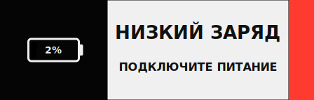

### Экран 3: Основное отображение (базовый)


### Экран 1: Приветствие / Wi‑Fi Setup


### Экран 2: Код привязки (Claim)


### Экран 4: Низкий заряд батареи


### Экран 5: Нет сети


- (1) name — тикер / идентификатор актива (`single.name`).
- (2) timestamp — время данных (`single.timestamp`).
- (3) price — текущая цена (`currencySymbol` + `single.price`).
- (4) portfolioValue + portfolioChangePercent — агрегированная стоимость + % изменения.
- (5) ledColor / trend bar — динамическая полоса или LED (green/red/purple/blue/yellow/white).


Кратко: Welcome → Claim Code → (Low Battery / No Network как межсостояния) → Main Display. LED пульсирует на первых двух экранах, затем заменяется столбцом тренда. Low Battery полностью перекрывает контент. No Network сохраняет последние данные (монохром).

- [Этапы](#этапы)
- [Ключевые принципы](#ключевые-принципы)
  - [Диаграмма: Основной поток (Claim → Attach → Poll → Heartbeat)](#диаграмма-основной-поток-claim--attach--poll--heartbeat)
  - [Примечание по Revoke и Refresh](#примечание-по-revoke-и-refresh)
  - [1. Device Claim](#1-device-claim)
  - [2. User Attach](#2-user-attach)
  - [3. Poll + Одноразовая выдача секрета](#3-poll--одноразовая-выдача-секрета)
  - [4. Работа устройства после авторизации](#4-работа-устройства-после-авторизации)
  - [5. Жизненный цикл секрета](#5-жизненный-цикл-секрета)
  - [6. State Machine](#6-state-machine)
  - [7. Display Instruction (формат)](#7-display-instruction-формат)
  - [8. Безопасность привязки (HMAC)](#8-безопасность-привязки-hmac)
  - [9. Ошибки (единый формат)](#9-ошибки-единый-формат)
- [Процесс и параметры отображения](#процесс-и-параметры-отображения)
  - [Flow обновления отображения](#flow-обновления-отображения)
  - [Поля инструкции отображения](#поля-инструкции-отображения)
    - [Тип `single`](#тип-single)
    - [Тип `playlist`](#тип-playlist)
  - [Правила формирования `hash`](#правила-формирования-hash)
  - [Идемпотентность обновлений](#идемпотентность-обновлений)
  - [Безопасность](#безопасность)
- [Телеметрия устройства и собираемые данные](#телеметрия-устройства-и-собираемые-данные)
  - [Источники телеметрии](#источники-телеметрии)
  - [Поля, которые устройство отправляет](#поля-которые-устройство-отправляет)
  - [Поля, которые портал/бэкенд хранит или выводит](#поля-которые-порталбэкенд-хранит-или-выводит)
  - [Конфиденциальность и минимизация](#конфиденциальность-и-минимизация)
  - [Использование телеметрии порталом](#использование-телеметрии-порталом)

## Этапы
1. Device Claim (устройство просит код)
2. User Attach (пользователь подтверждает владение кодом)
3. Lazy Secret Issue (устройство получает секрет при первом poll после attach)
4. Authenticated Operation (heartbeat + получение/обновление отображения)
5. Secret Refresh / Revoke (жизненный цикл секрета)

## Ключевые принципы
- Секрет не создаётся при привязке пользователем — только при первом успешном poll устройства (ленивая одноразовая выдача).
- Plaintext секрета никогда не хранится на сервере; хранится только хеш (argon2id/bcrypt).
- Повторное раскрытие секрета запрещено (последующие poll → 404/410).
- Ротация по запросу устройства с перекрытием (~5 мин) + автоматическое истечение (90 дней, refresh ≥ 75%).
- Отзыв (revoke) немедленно инвалидирует текущий секрет; устройство возвращается к стадии claim.

### Диаграмма: Основной поток (Claim → Attach → Poll → Heartbeat)


### Примечание по Revoke и Refresh
Refresh выполняется устройством через `POST /devices/{id}/secret/refresh` (Bearer секрет). Портал не должен получать plaintext новый секрет (минимизация поверхности утечки). Revoke инициируется пользователем через JWT: `POST /devices/{id}/revoke`.

### 1. Device Claim
`POST /device-claims` { mac, hmac, firmwareVersion, ip } (operationId: issueClaimCode)
→ Выдаёт 6‑значный код (TTL ~5 мин). Повторный запрос до истечения может переиспользовать код.

### 2. User Attach
`POST /device-claims/{code}/attach` (JWT пользователя) (operationId: attachClaimCode)
→ Связывает устройство с userId, переводит claim в статус claimed. Секрет НЕ создаётся.

### 3. Poll + Одноразовая выдача секрета
`GET /device-claims/{code}/poll` (без аутентификации) (operationId: pollClaimCode)
- pending → 202 {status}
- first claimed (секрет ещё не выдан) → генерация 32 байт, сохранение хеша, ответ 200 {deviceId, deviceSecret, displayHash, expiresAt}
- subsequent polls → 404
- expired → 410

Формат секрета: префикс ds_, длина 64 символа (32 байта base64/алфавит). Пример: ds_1a2b…

### 4. Работа устройства после авторизации
Bearer Authorization: секрет устройства.

Основные эндпоинты:
- `POST /devices/{id}/heartbeat` {battery, rssi, ip, fwVersion, uptime, displayHash} (operationId: heartbeat)
    - Валидация секрета → обновление телеметрии → сравнение displayHash
    - Если hash отличается: возвращается {instruction, displayHash}; иначе {ok:true}
- `GET /devices/{id}/display/hash` → быстрый опрос хеша (operationId: getDisplayHash)
- `GET /devices/{id}/display/full` → получение инструкции при изменении (operationId: getDisplayInstruction)
- `POST /devices/{id}/secret/refresh` → выдаёт новый секрет (старый действует ещё ~5 мин) (operationId: refreshSecret)
- `POST /devices/{id}/revoke` (JWT) → немедленный отзыв (следующий запрос устройства даст 401) (operationId: revokeDevice)

### 5. Жизненный цикл секрета
- TTL: 90 дней
- Refresh разрешён c 75% срока (≥ день 68)
- Перекрытие: старый секрет валиден короткое окно (константа, например 5 мин)
- Revoke: немедленная инвалидация (heartbeat → 401 → устройство инициирует новый claim)
Примечание: Единственный допустимый источник plaintext нового секрета — ответ на device-initiated `POST /devices/{id}/secret/refresh`.

### 6. State Machine


### 7. Display Instruction (формат)
Single или Playlist. Хеш: канонический JSON (отсортированные ключи) → SHA-256 hex, префикс sha256:.

Пример Single:
```json
{"type":"single","version":12,"hash":"sha256:...","single":{"name":"BITCOIN","price":48250.23,"currencySymbol":"$","timestamp":"2025-09-14T10:00:00Z"}}
```

Пример Playlist (укорочено):
```json
{"type":"playlist","version":13,"hash":"sha256:...","playlist":{"displaySeconds":8,"items":[{"name":"BTC","price":48250.23},{"name":"ETH","price":3800.11}]}}
```

### 8. Безопасность привязки (HMAC)
HMAC_SHA256(device_hmac_key, mac || firmwareVersion || timestampRoundedToMinute)
- Проверка дрейфа времени (≤2 мин)
- Защита от повторов (dedupe по (mac,timestamp) или nonce)

### 9. Ошибки (единый формат)
{"message":"..."}
- 401 Invalid / expired / missing secret
- 404 Повторный poll после выдачи
- 410 Claim expired

## Процесс и параметры отображения

### Flow обновления отображения
1. Пользователь через портал вызывает `PUT /devices/{id}/display` с новой инструкцией (`single` или `playlist`).
2. Backend пересчитывает канонический JSON и SHA-256 → `displayHash` и сохраняет версию (version++).
3. Устройство на очередном `POST /devices/{id}/heartbeat` отправляет свой известный `displayHash`.
4. Если хеш отличается — возвращается новая инструкция (inline) или минимальный ответ с `instruction` и новым `displayHash`.
5. Устройство применяет инструкцию и начинает показывать, переходя в steady-state пока хеш не изменится.

Опционально устройство может использовать:
- `GET /devices/{id}/display/hash` для дешёвого опроса (проверка только хеша).
- `GET /devices/{id}/display/full?ifHash=...` чтобы получить полный объект, если изменился.

### Поля инструкции отображения
Общие базовые поля (у обоих типов):
- `type`: `single|playlist`.
- `version`: монотонно растущая для конкретного устройства.
- `hash`: `sha256:<hex>` хеш канонического JSON.
- `extensions`: произвольные будущие расширения (обе стороны должны игнорировать неизвестные поля).

#### Тип `single`
`single` объект описывает одну «карточку» данных.
- `name`: строка (тикер / имя / метка портфеля).
- `price`: число (double) текущая цена/значение.
- `currencySymbol`: символ валюты например `$`.
- `timestamp`: ISO8601 время данных.
- `ledColor`: enum `blue|green|red|yellow|purple` (подсветка).
- `beep`: boolean (однократный звуковой сигнал при получении обновления).
- `flashCount`: int количество вспышек экрана/LED.
- `ledBrightness`: enum `off|low|mid|high`.
- `portfolioValue`: число — общая стоимость портфеля.
- `portfolioChangeAbsolute`: абсолютное изменение.
- `portfolioChangePercent`: процент изменения (5 = +5%).
- `extensions`: future-proof контейнер.

#### Тип `playlist`
`playlist` объект:
- `items`: массив элементов формата `single` (без вложенных плейлистов).
- `displaySeconds`: int — сколько секунд показывать каждый элемент.
- `extensions`: future-proof.

### Правила формирования `hash`
1. Строим объект инструкции (включая вложенные объекты) с отсортированными ключами (канонический JSON).
2. Сериализуем без лишних пробелов.
3. Вычисляем SHA-256 → hex.
4. Префиксируем `sha256:`.

### Идемпотентность обновлений
Если портал повторно отправляет идентичную инструкцию (ключевая структура и значения не изменились) — `hash` совпадёт, версия МОЖЕТ остаться прежней (реализация) либо быть инкрементирована; устройство ориентируется на `hash` как источник истины для необходимости обновления.

### Безопасность
- Инструкция не содержит чувствительных данных — может кэшироваться plaintext.
- Валидация типов/диапазонов на устройстве (defensive) чтобы игнорировать потенциально некорректные поля из будущих расширений.

## Телеметрия устройства и собираемые данные

### Источники телеметрии
Телеметрия поступает в API главным образом из `POST /devices/{id}/heartbeat`. Дополнительно некоторые атрибуты фиксируются при `claim`.

### Поля, которые устройство отправляет
- `battery` (int %) — заряд батареи.
- `rssi` (int) — уровень сигнала Wi-Fi.
- `ip` (string) — внешний локальный IP, по которому устройство себя видит (диагностика сети).
- `firmwareVersion` — версия прошивки (обновляется при каждом heartbeat или claim).
- `uptimeSeconds` — аптайм на момент heartbeat.
- `displayHash` — хеш инструкции, который устройство считает текущим.

### Поля, которые портал/бэкенд хранит или выводит
- `mac` — MAC, получен при `claim`.
- `userId` — владелец.
- `status` — `awaiting_claim|active|revoked`.
- `lastSeen` — timestamp последнего успешного heartbeat.
- `secretExpiresAt` — когда истечёт текущий секрет.
- `deviceSecretHash` (только админ) — хеш секрета (никогда не plaintext).
- `currentDisplayType` — single или playlist (инференс из последней инструкции).
- `displayHash` — последний сохранённый хеш.

### Конфиденциальность и минимизация
- Не собирать лишние сетевые метаданные (геолокация, hostnames) без явной необходимости.
- IP хранить только последний (перезапись) для диагностики; опционально — усечение до /24 для приватности.

### Использование телеметрии порталом
- Отображение состояния онлайн / офлайн (`lastSeen` > threshold → offline).
- Показ заряда батареи и сигнала.
- Диагностика при support (MAC, fwVersion, RSSI).


