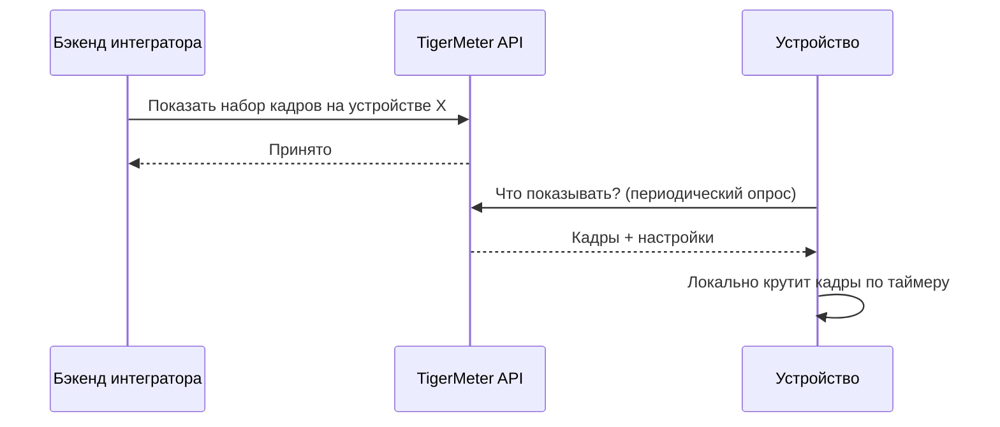

# TigerMeter API как сервис отображения — предложение

## Суть

TigerMeter API становится тонким микросервисом доставки изображения на устройство. Сервис не знает о котировках, счетах и пользователях. Единственная задача: принять готовую картинку от внешнего бэкенда и надёжно показать её на нужном устройстве.

Вся бизнес-логика (котировки, позиции, PnL, алерты, дизайн экрана, ротация слайдов) остаётся на стороне интегратора. Сервис отвечает только за доставку на устройство.

## Преимущества

- **Полный контроль контента.** Экран рисуется на стороне интегратора и присылается готовым изображением — без ограничений по шрифтам, шаблонам и набору логотипов.
- **Изоляция данных.** Сервис не ходит за котировками и ничего не знает о пользователях — меньше рисков по безопасности и приватности.
- **Простая интеграция.** Обращение по сервисному ключу (server-to-server): один вызов — «показать эту картинку на устройстве X».
- **Экономия батареи.** Устройство само прокручивает кадры по таймеру и обращается к сети редко.

## Как это работает

1. Устройство привязывается к аккаунту по 6-значному коду.
2. Бэкенд присылает один или несколько готовых кадров плюс параметры подсветки/звука и время показа каждого кадра.
3. Устройство при выходе на связь забирает новые кадры и дальше само переключает их локально.

## Что доставляется на устройство

- Кадры экрана — монохромные изображения 384×168 (полный экран).
- Для каждого кадра: цвет и яркость LED, длительность показа, разовый звук и вспышки (для алертов).
- Частота выхода устройства на связь — настраивается.

## Умное обновление

Изменения передаются только когда они есть: устройство сообщает hash текущих кадров в heartbeat, и если он не поменялся — трафик не тратится. Это ускоряет отклик и бережёт батарею.

## Границы

Без изменений: привязка по коду, обновление прошивки по воздуху (OTA), телеметрия (заряд, сигнал, онлайн/офлайн), сброс и отвязка.

Уходит из сервиса: логика слайдов, ротации, алертов и дизайна экрана; встроенные логотипы и их загрузка — вместо этого присылается готовый экран.

## Итог

Предсказуемый, безопасный и простой в интеграции сервис, который делает ровно одно: показывает переданную картинку на устройстве. Продуктовая логика и данные остаются на стороне интегратора.
