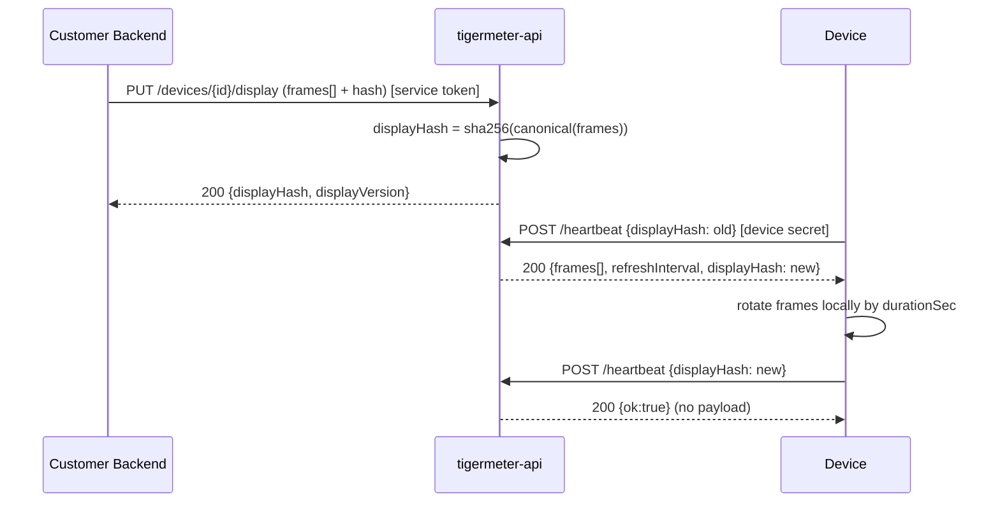

# Bitmap Display Microservice

## Concept

The service stops knowing anything about tickers, users, quotes, fonts, or layout. It becomes a pure delivery gateway:

- Customer backend (service-to-service auth) pushes **frames**: pre-rendered images.
- Device pulls frames on heartbeat, **rotates them locally** by `durationSec`.
- Partial update preserved: one `displayHash` over the whole frame payload; heartbeat returns frames only when hash changed.



## Display resolution
Confirmed `GDEY029T71H` = **384x168 landscape mono** (see [firmware/src/Display.h](../firmware/src/Display.h) lines 22-28). One frame = 384*168/8 = **8064 bytes** packed 1-bit; ~10.7 KB as base64. Cap frame count (proposed 8) to bound ESP32 RAM (~64 KB for 8 raw frames).

## New display payload (PUT /devices/:id/display)
```json
{
  "version": 5,
  "hash": "sha256:...",
  "frames": [
    { "bitmap": "base64-8064-bytes", "ledColor": "green", "ledBrightness": "mid", "durationSec": 30, "beep": false, "flashCount": 0 }
  ],
  "refreshInterval": 60
}
```
- `bitmap`: packed 1-bit 384x168 (same convention as current `symbolBitmap`: 1=white,0=black), device draws directly.
- LED/beep/flash/duration are **per-frame** (not in pixels).
- `refreshInterval`: heartbeat cadence.
- Hash covers the canonical payload (frames + refreshInterval), `beep`/`flashCount` are cleared server-side after delivery like today.

## API changes ([node-api/src/routes](../node-api/src/routes))

### Auth: service-to-service ([node-api/src/plugins/auth.ts](../node-api/src/plugins/auth.ts))
- Add `requireService(request)` verifying a service JWT/API key; extract opaque `tenantId` (replaces `userId` semantics) and optional `scope` (`manage` vs `admin`).
- Control-plane routes use `requireService`; tenant isolation via `tenantId` instead of user identity.
- Keep device-secret auth (`requireDevice`) unchanged.

### [portal.ts](../node-api/src/routes/portal.ts) (control-plane, service token)
- Replace the entire `DisplayInstruction` zod schema with a `DisplayFrames` schema (`frames[]` + `refreshInterval`).
- `PUT /devices/:id/display`: validate frames (size/count/base64), compute hash via updated util, store `displayFramesJson`, bump `displayVersion`.
- `GET /devices` and `GET /devices/:id`: return telemetry + `displayHash` + `displayVersion` (no rendered fields). Scope by `tenantId`.
- Keep `POST /devices/:id/revoke`.
- Add `PATCH /devices/:id` for `autoUpdate` (+ optional `name` label).

### [devices.ts](../node-api/src/routes/devices.ts) (device-plane, unchanged flow)
- `POST /devices/:id/heartbeat`: on hash mismatch return `{ frames, refreshInterval, displayHash }`; strip per-frame `beep`/`flashCount` after send (existing pattern, lines 82-96). Remove predefined-logo injection (lines 98-105).
- `GET /devices/:id/display/hash` and `/display/full` stay (serve frames payload).

### [device-claims.ts](../node-api/src/routes/device-claims.ts)
- Remove the `welcomeInstruction` text seed (lines 136-166). Attach no longer seeds display; device shows a firmware-side "waiting for content" system screen until first frames arrive.

### Removed entirely
- [node-api/src/routes/admin-logos.ts](../node-api/src/routes/admin-logos.ts) and its registration in [server.ts](../node-api/src/server.ts) line 49.
- `Logo` model + `sharp`/`@fastify/multipart` deps.

## Hashing ([node-api/src/utils/crypto.ts](../node-api/src/utils/crypto.ts))
- Keep `instructionHash` (recursive-sorted-keys + sha256); it works on the frames object as-is. Client still computes the same hash (mirror of web-emulator `computeDisplayHash`).

## DB schema ([node-api/prisma/schema.prisma](../node-api/prisma/schema.prisma))
- `Device`: rename `displayInstructionJson` -> `displayFramesJson`; drop `currentDisplayType` and `ledBrightness` (now per-frame); keep `displayHash`, `displayVersion`; keep `userId` but treat as opaque `tenantId`; add optional `name`.
- Delete `Logo` model.
- Migration via `prisma migrate dev`.

## Firmware (full rewrite of main-display path)
- [firmware/src/utility/ApiClient.h](../firmware/src/utility/ApiClient.h): replace `HeartbeatResult` display fields (lines 100-123) with a `frames[]` structure (per-frame decoded bitmap buffer + ledColor/ledBrightness/durationSec/beep/flashCount) + `refreshInterval`. Base64-decode each frame; cap count.
- [firmware/src/main.ino](../firmware/src/main.ino): remove symbol carousel (lines 84-89, 630-638), predefined logos (`getPredefinedBitmap`, `drawPredefinedLogo`, lines 756-799), `symbolImage`, and all text rendering for the main screen. Add a **local rotation timer** over frames using `durationSec`; draw each frame full-screen via existing `Display::drawBitmap` (384x168); apply per-frame LED/beep/flash; heartbeat every `refreshInterval`.
- Delete [firmware/src/BinanceLogo.h](../firmware/src/BinanceLogo.h) and [firmware/src/CurrencySymbols.h](../firmware/src/CurrencySymbols.h).
- Keep fonts + [CaptivePortal.cpp](../firmware/src/CaptivePortal.cpp) + system screens (claim code, low-battery, no-network, waiting-for-content) since those remain firmware-rendered text.

## web-emulator (keep compiling)
- [web-emulator/src/api/client.ts](../web-emulator/src/api/client.ts): `setDisplay` sends frames; drop logo methods.
- [web-emulator/src/types/display.ts](../web-emulator/src/types/display.ts), [AdminPanel.tsx](../web-emulator/src/components/AdminPanel.tsx), [Screen.tsx](../web-emulator/src/components/Screen.tsx): switch preview to render packed bitmaps + frame rotation; remove instruction-field form.

## Docs
- Rewrite the display sections of [README.md](../README.md) (fields, hash rules, telemetry unchanged) to describe frames + service-to-service auth.

## Out of scope (unchanged)
Claim/attach/secret lifecycle, telemetry, OTA (`autoUpdate`, firmware version/url), factory-reset, revoke.

## Task checklist
- [ ] **auth-service**: Add requireService (service-to-service token -> opaque tenantId + scope) in plugins/auth.ts; wire control-plane routes to it
- [ ] **schema**: Prisma: rename displayInstructionJson->displayFramesJson, drop currentDisplayType/ledBrightness, add name, treat userId as tenantId, delete Logo model; run migration
- [ ] **portal-frames**: Replace DisplayInstruction schema with DisplayFrames (frames[]+refreshInterval); update PUT display, GET list/detail scoped by tenantId; add PATCH /devices/:id
- [ ] **device-heartbeat**: Update heartbeat/display endpoints to serve frames payload; strip per-frame beep/flashCount after send; remove logo injection
- [ ] **claims-welcome**: Remove welcomeInstruction text seed from attach
- [ ] **remove-logos**: Delete admin-logos route + registration, Logo model, sharp/multipart deps
- [ ] **firmware-apiclient**: Rewrite HeartbeatResult in ApiClient.h to frames[] with base64 decode + count cap
- [ ] **firmware-main**: Rewrite main.ino main-display path: remove carousel/logos/text render, add local frame rotation + full-screen drawBitmap + per-frame LED/beep
- [ ] **emulator**: Update web-emulator client/types/AdminPanel/Screen to send and preview frames
- [ ] **docs**: Rewrite README display sections for frames + service-to-service auth
