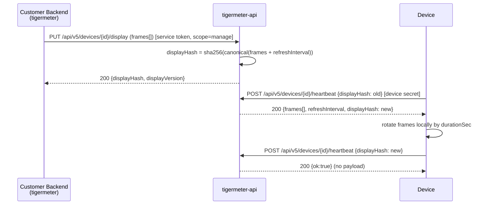

# Bitmap Display Microservice

## Concept

Pure frame-delivery gateway. The service knows nothing about tickers, quotes, fonts, or layout.

- **Customer backend** (`tigermeter` — single tenant) pushes **frames**: pre-rendered 1-bit bitmaps via service-token auth.
- **Device** pulls frames on heartbeat, **rotates them locally** by per-frame `durationSec`.
- **Web admin** (this repo, replaces web-emulator) is an **ops + demo tool** for the firmware author: fleet overview, pending approve, frame editor for testing. The customer builds their own admin on top of the same API.
- Partial update: one `displayHash` over the canonical frame payload; heartbeat returns frames only when hash changed.



## Display resolution

Confirmed `GDEY029T71H` = **384x168 landscape mono** ([firmware/src/Display.h](../firmware/src/Display.h) lines 22-28). One frame = 384*168/8 = **8064 bytes** packed 1-bit; ~10.7 KB as base64. Cap frame count at **8** to bound ESP32 RAM (~64 KB for 8 raw frames).

## API versioning

All routes are prefixed with **`/api/v5/`**. Fastify route registration uses a `v5Prefix` constant. Old unversioned routes are removed in the same deploy (no legacy support needed — no production users yet).

## New display payload (PUT /api/v5/devices/:id/display)

```json
{
  "frames": [
    {
      "bitmap": "base64-8064-bytes",
      "ledColor": "green",
      "ledBrightness": "mid",
      "durationSec": 30,
      "beep": false,
      "flashCount": 0
    }
  ],
  "refreshInterval": 60
}
```

- `bitmap`: packed 1-bit 384x168, row-major, MSB-first (same convention as current `symbolBitmap`: 1=white, 0=black). Device draws full-screen, no composition.
- `ledColor` / `ledBrightness` / `durationSec` / `beep` / `flashCount` are **per-frame**.
- `refreshInterval`: heartbeat cadence in seconds.

### Validation rules (PUT)

Server rejects with 400 if any of:
- `frames` missing, not an array, length `0` or `> 8`
- any `bitmap` invalid base64 or decodes to ≠ **8064 bytes**
- `durationSec` not integer or outside `1..86400`
- `refreshInterval` not integer or outside `10..3600`
- `ledColor` not in `{green, red, blue, yellow, cyan, magenta, white, rainbow, off}`
- `ledBrightness` not in `{low, mid, high, off}`
- `flashCount` not integer or outside `0..10`
- `beep` not boolean

Unknown keys are **rejected** (`z.strict()`).

### Hash semantics

`displayHash = "sha256:" + hex( sha256( canonical(frames + refreshInterval) ) )` where `canonical` = recursive sorted-keys JSON (existing `instructionHash` util).

**Hash includes one-shot fields (`beep`, `flashCount`).** No strip logic. If the customer wants to re-beep, they PUT the same frames with `beep:true` again — this produces a new hash, device re-downloads, beeps, and treats one-shot fields as consumed locally. Cost: one extra ~10KB-per-frame download per re-beep. Benefit: no server-side strip util, no client-side mirror, no special cases.

## Auth model

### Service tokens (env config, no DB)

```bash
# .env
SERVICE_TOKENS='[
  {"token":"sk-ops-XXX",     "tenantId":"ops",       "scope":"ops"},
  {"token":"sk-tigermeter-YYY","tenantId":"tigermeter","scope":"manage"}
]'
```

- Loaded at boot in [config.ts](../node-api/src/config.ts) via zod; fail-fast on parse error.
- `requireService(request)` reads `Authorization: Bearer <token>`, looks up in the list, attaches `request.serviceAuth = { tenantId, scope }`.
- Two scopes:
  - **`ops`** — full access: all devices regardless of tenant, pending approve/reject, factory reset, delete, settings, view frames of any device (for debugging).
  - **`manage`** — scoped to own tenant: CRUD on devices where `Device.tenantId = <tenant>`, PUT display, PATCH settings. Cannot see other tenants' devices (404, not 403 — don't leak existence).

Since there's exactly one tenant (`tigermeter`) today, the implementation doesn't need generic multi-tenant machinery — just string equality on `tenantId`. If a second customer ever appears, the schema already supports it.

### Device auth

`requireDevice` (device-secret JWT) unchanged.

### User JWT — REMOVED

`requireUser` / `requireAdmin` decorators are deleted. The admin UI logs in with a service token directly (paste-once, stored in localStorage). There are no human users of this API — only services.

## Claim flow (device generates code, tenant attaches)

The flow stays, but attach is performed by the **tenant's service token**, not a user JWT:

```
1. Device powers on, no WiFi credentials → AP mode + captive portal
2. User configures WiFi via captive portal (unchanged)
3. Device calls POST /api/v5/device-claims {mac, firmwareVersion, hmac} → gets {code, expiresAt}
4. Device displays the 6-digit code on e-ink (unchanged)
5. End user enters the code in the customer's app
6. Customer backend calls:
     POST /api/v5/device-claims/:code/attach
     Authorization: Bearer <tigermeter-token>
     Body: {"externalUserId": "their-internal-user-id"}
7. Server validates code, binds device:
     Device.tenantId = "tigermeter"  (from service token)
     Device.externalUserId = "their-internal-user-id"
     Device.status = "active"
8. Device polls claim status on next heartbeat (or a GET /device-claims/:code/poll), sees "claimed", stops showing code
9. Customer pushes first frames → device shows content
```

**Composite ownership key:** `Device` has `tenantId` (from service token) + `externalUserId` (opaque string from customer). Tenant-scoped queries filter `WHERE tenantId = ?`. The `externalUserId` is purely informational for the customer's own bookkeeping and shows up in ops admin for debugging.

**Rate limit:** `POST /device-claims/:code/attach` gets a strict rate limit (5 attempts/minute per IP) to prevent 6-digit brute force. The existing `rate-limit.js` plugin covers this.

**Expiration:** codes expire after 15 minutes (unchanged). After expiry, device generates a new code on next boot or on user button press.

## API changes ([node-api/src/routes](../node-api/src/routes))

### [plugins/auth.ts](../node-api/src/plugins/auth.ts)

- Add `requireService(request)` and `requireScope('manage' | 'ops')`.
- **Delete** `requireUser` and `requireAdmin`.

### [routes/portal.ts](../node-api/src/routes/portal.ts) — control-plane, `scope=manage`

All paths under `/api/v5/`.

- `PUT /devices/:id/display`:
  - `requireScope('manage')`.
  - Validate via `DisplayFrames` schema (strict, limits above).
  - Verify `device.tenantId === request.serviceAuth.tenantId` → 404 if not.
  - Compute `displayHash`, persist `displayFramesJson`, bump `displayVersion`.
  - Return `{displayHash, displayVersion}`.
- `GET /devices`: `requireScope('manage')`, filter by `tenantId`, return `{id, mac, name, status, lastSeen, battery, firmwareVersion, displayHash, displayVersion, externalUserId}` — **no `displayFramesJson`** (control-plane doesn't read content back; if the customer wants it, they have it client-side).
- `GET /devices/:id`: same scoping, same fields.
- `PATCH /devices/:id`: `requireScope('manage')`, body `{name?, autoUpdate?, demoMode?}`; tenant-scoped.
- `POST /devices/:id/revoke`: `requireScope('manage')`, tenant-scoped.

### [routes/admin.ts](../node-api/src/routes/admin.ts) — ops-plane, `scope=ops`

All paths under `/api/v5/admin/`.

- `GET /devices`: all devices, all tenants. Returns `displayFramesJson` (ops can view frames for debugging) + `tenantId` + `externalUserId`.
- `GET /devices/:id/display`: returns `displayFramesJson` for any device (ops only).
- `POST /devices/:id/revoke`, `DELETE /devices/:id`, `POST /devices/:id/factory-reset`, `PATCH /devices/:id/settings` — unchanged behavior, `requireScope('ops')`.
- `GET /pending-devices`, `POST /pending-devices/:id/approve`, `POST /pending-devices/:id/reject`:
  - Approve body: `{tenantId: "tigermeter"}` — assigns the device to a tenant before any claim happens. Device moves from `PendingDevice` to `Device` with `status='awaiting_claim'`, `tenantId` set.
  - Reject: unchanged (deletes the pending entry).
- `GET /settings`, `PATCH /settings` (auto-provision toggle) — unchanged, `requireScope('ops')`.

### [routes/devices.ts](../node-api/src/routes/devices.ts) — device-plane, `requireDevice`

All paths under `/api/v5/`.

- `POST /devices/:id/heartbeat`:
  - Base response: `{ok, autoUpdate, demoMode, latestFirmwareVersion, firmwareDownloadUrl}`.
  - Hash match → return base only.
  - Hash mismatch or missing → read `displayFramesJson`, return `{...base, frames, refreshInterval, displayHash}`.
  - `displayFramesJson IS NULL` → return `{...base, frames: [], refreshInterval: 60, displayHash: null}` — device shows "waiting for content".
  - **Remove** post-send beep/flash cleanup (lines 85-96) — no strip, no cleanup.
  - **Remove** predefined-logo injection (lines 98-105).

### [routes/device-claims.ts](../node-api/src/routes/device-claims.ts)

All paths under `/api/v5/`.

- `POST /device-claims` (device, HMAC auth): unchanged — generates code, device displays it.
- `GET /device-claims/:code/poll` (device, HMAC auth): unchanged — device polls for claim status.
- `POST /device-claims/:code/attach`:
  - **Replace `requireUser` with `requireScope('manage')`.**
  - Body: `{externalUserId: string}` (required, max 128 chars).
  - Sets `Device.tenantId = request.serviceAuth.tenantId`, `Device.externalUserId = body.externalUserId`, `Device.status = 'active'`.
  - **Remove** `welcomeInstruction` seed (lines 136-166) — display stays empty until first PUT.
- **Remove** all user-JWT-based routes from this file if any remain.

### Removed entirely

- [routes/admin-logos.ts](../node-api/src/routes/admin-logos.ts) + registration in [server.ts](../node-api/src/server.ts).
- `Logo` model from [prisma/schema.prisma](../node-api/prisma/schema.prisma).
- `sharp` and `@fastify/multipart` from `package.json`.
- User JWT machinery: `verifyJwt` util if not used by device secrets, `createTestUserToken` / `createTestAdminToken` in web admin.

## Hashing ([node-api/src/utils/crypto.ts](../node-api/src/utils/crypto.ts))

- Rename `instructionHash` → `displayPayloadHash`. Algorithm unchanged (recursive sorted-keys + sha256).
- No strip helpers — hash covers everything.
- Delete `verifyJwt` if it was only used for user/admin auth (device secrets use a different mechanism — verify).

## DB schema ([node-api/prisma/schema.prisma](../node-api/prisma/schema.prisma))

```prisma
model Device {
  id                     String   @id @default(uuid())
  mac                    String   @unique
  tenantId               String?  // was userId — opaque, from service token
  externalUserId         String?  // NEW: customer's own user id, opaque
  name                   String?  // NEW: human label, set via PATCH
  status                 String   @default("awaiting_claim")

  // Provisioning
  hmacKey                String?

  // Telemetry
  lastSeen               DateTime?
  battery                Int?
  rssi                   Int?
  ip                     String?
  firmwareVersion        String?

  // Display state
  displayHash            String?
  displayVersion         Int      @default(0)
  displayFramesJson      String?  // renamed from displayInstructionJson
  // REMOVED: currentDisplayType, ledBrightness

  // Secrets
  currentSecretHash      String?
  currentSecretExpiresAt DateTime?
  previousSecretHash     String?
  previousSecretExpiresAt DateTime?

  // Remote commands
  pendingFactoryReset    Boolean  @default(false)

  // OTA
  autoUpdate             Boolean  @default(true)

  // Demo
  demoMode               Boolean  @default(false)

  createdAt              DateTime @default(now())
  updatedAt              DateTime @updatedAt

  claims                 DeviceClaim[]

  @@index([tenantId])
}

model DeviceClaim {
  // unchanged
}

model PendingDevice {
  // unchanged
}

model Setting {
  // unchanged
}

// REMOVED: model Logo
```

Migration: `prisma migrate dev --name bitmap-display-frames-v5`. Since no production data exists, the migration can be destructive (`DROP` old columns) rather than data-preserving.

## Firmware (full rewrite of main-display path)

### [firmware/src/utility/ApiClient.h](../firmware/src/utility/ApiClient.h)

```cpp
struct DisplayFrame {
  uint8_t bitmap[8064];  // decoded
  char ledColor[12];
  char ledBrightness[8];
  uint32_t durationSec;
  bool beep;
  uint8_t flashCount;
};
struct HeartbeatResult {
  // ... telemetry/OTA unchanged ...
  DisplayFrame frames[8];
  uint8_t frameCount;
  uint32_t refreshInterval;
  char displayHash[80];
  bool hasNewDisplay;
};
```

- Base64-decode each frame; reject frames ≠ 8064 bytes (skip + log, continue with rest).
- Cap `frameCount` at 8; truncate extras.

### [firmware/src/main.ino](../firmware/src/main.ino)

- Remove symbol carousel (lines 84-89, 630-638), `getPredefinedBitmap` / `drawPredefinedLogo` (lines 756-799), `symbolImage`, all text rendering on main screen.
- Local rotation timer:
  - `frameCount == 0` → draw "waiting for content" system screen, heartbeat every `refreshInterval`, no rotation.
  - `hasNewDisplay` → store frames, reset index to 0, draw frame 0 via `Display::drawBitmap(0, 0, 384, 168, frame.bitmap)`, apply per-frame LED/beep/flash.
  - Every `frames[i].durationSec` → advance (wrap), redraw, apply LED/beep/flash.
  - `beep`/`flashCount` are **one-shot per download**: fire on first show of each frame after `hasNewDisplay`, then locally cleared (in RAM, not in the stored copy). Do not re-fire on rotation.
  - Every `refreshInterval` → heartbeat, reload on `hasNewDisplay`.
- System screens (claim code, low-battery, no-network, waiting-for-content) remain firmware-rendered text, take precedence.
- Delete [firmware/src/BinanceLogo.h](../firmware/src/BinanceLogo.h) and [firmware/src/CurrencySymbols.h](../firmware/src/CurrencySymbols.h).
- Keep fonts + [CaptivePortal.cpp](../firmware/src/CaptivePortal.cpp) (claim/system screens still need text).

## Web admin (ops + demo tool)

Replaces `web-emulator/`. Same Vite/React app, new purpose: **ops fleet management + frame editor for testing**. The customer builds their own admin separately.

### Auth

- `/login` — paste service token (stored in localStorage). Server exposes `GET /api/v5/admin/me` → `{tenantId, scope}` so UI knows what to show.
- No user JWT anywhere.

### Routes / views

- `/devices` — all devices (ops). Columns: name, mac, tenantId, externalUserId, status, lastSeen, battery, firmwareVersion, displayHash, displayVersion. Row click → `/devices/:id`.
- `/devices/:id` — tabs:
  - **Overview**: telemetry, name edit, autoUpdate/demoMode toggles, revoke/factory-reset/delete.
  - **Frames**: editor (see below).
  - **Activity**: heartbeat log polling.
- `/pending` — approve/reject. Approve modal asks for `tenantId` (default `"tigermeter"`).
- `/settings` — auto-provision toggle.

### Frame editor (`/devices/:id` Frames tab)

- Canvas 384x168, 1-bit, 2x nearest-neighbor scale.
- Tools: pencil, eraser, fill, line, rect, text (built-in bitmap font — reuse DejaVu 24/28/32 from firmware, converted to JS), invert, clear.
- Import PNG → client-side resize + Floyd-Steinberg dithering → load as frame.
- Frame list (up to 8): per-frame `durationSec`, `ledColor`, `ledBrightness`, `beep`, `flashCount`; drag-and-drop reorder; duplicate; delete.
- Preview: plays rotation at real speed.
- **Save**: convert canvases → packed base64 → build payload → compute hash client-side (mirror of server util) → PUT `/api/v5/devices/:id/display` → show returned `displayHash`/`displayVersion`.
- **Load current**: GET `/api/v5/admin/devices/:id/display` (ops only) → decode into canvases.

### API client ([web-emulator/src/api/client.ts](../web-emulator/src/api/client.ts))

- Drop: `issueClaim`, `pollClaimCode`, `sendHeartbeat`, `listLogos`, `uploadLogo`, `deleteLogo`, old `setDisplay`, user-JWT helpers.
- Add: `login(token)`, `me()`, `listDevices()`, `getDevice(id)`, `getDeviceFramesOps(id)`, `setDisplayFrames(id, payload)`, `patchDevice(id, {...})`, `revoke(id)`, `deleteDevice(id)`, `factoryReset(id)`, `listPending()`, `approvePending(id, tenantId)`, `rejectPending(id)`, `getAdminSettings()`, `patchAdminSettings()`.
- Keep `computeDisplayHash` (recursive sorted-keys + sha256).
- Keep `loggedFetch` for activity log.

### Types ([web-emulator/src/types/display.ts](../web-emulator/src/types/display.ts))

```ts
export interface DisplayFrame {
  bitmap: string;
  ledColor: LedColor;
  ledBrightness: LedBrightness;
  durationSec: number;
  beep?: boolean;
  flashCount?: number;
}
export interface DisplayFramesPayload {
  frames: DisplayFrame[];
  refreshInterval: number;
}
```

### Components

- **Delete**: [Screen.tsx](../web-emulator/src/components/Screen.tsx), [MacInput.tsx](../web-emulator/src/components/MacInput.tsx), [WifiToggle.tsx](../web-emulator/src/components/WifiToggle.tsx), logo UI in AdminPanel (lines 124-127, 323-362), entire `DisplayForm` (lines 53-101, 521-…).
- **Keep**: [LogPanel.tsx](../web-emulator/src/components/LogPanel.tsx).
- **Rewrite**: [AdminPanel.tsx](../web-emulator/src/components/AdminPanel.tsx) — new shell per above.

## Docs

- Rewrite display sections of [README.md](../README.md): new payload, hash rules, auth model, claim flow (tenant attach).
- Update [swagger.ru.yaml](../swagger.ru.yaml): new schemas, new auth, `/api/v5/` prefix, removed logo routes.
- Update [docs/claim-flow.md](../docs/claim-flow.md): device generates code, tenant attaches with service token + externalUserId.
- Update [docs/errors.md](../docs/errors.md): new validation errors.
- Update [docs/proposal-display-service.md](../docs/proposal-display-service.md) or delete if superseded.

## Out of scope

OTA (autoUpdate, firmware version/url), factory reset flow, secret rotation, telemetry ingestion — all unchanged.

## Migration / rollout

1. Deploy API v5 (new shape, `/api/v5/` prefix, service tokens only). Old firmware gets `frames:[]` → shows "waiting for content". Old-shape DB columns dropped by migration.
2. Flash all devices to new firmware via OTA or USB.
3. Deploy new web admin (replaces old web-emulator URL).
4. Add `SERVICE_TOKENS` to `.env` on API host.
5. Share `sk-tigermeter-YYY` + API docs with the customer.

## Task checklist

- [ ] **auth-service**: `requireService` + `requireScope` in plugins/auth.ts; load `SERVICE_TOKENS` from env via config.ts (zod); delete `requireUser`/`requireAdmin`; `GET /api/v5/admin/me`
- [ ] **api-versioning**: add `/api/v5/` prefix to all routes via a `v5Prefix` constant in server.ts; remove unversioned registrations
- [ ] **schema**: Prisma — rename `displayInstructionJson`→`displayFramesJson`, drop `currentDisplayType`/`ledBrightness`, add `name`, `tenantId` (rename `userId`), `externalUserId`, drop `Logo`; migrate
- [ ] **hash-util**: rename `instructionHash`→`displayPayloadHash`; delete `verifyJwt` if unused by device auth; no strip logic
- [ ] **portal-frames**: `DisplayFrames` strict zod schema; rewrite `PUT /devices/:id/display` (validate, hash, persist, tenant-scoped); `GET /devices`/`GET /devices/:id` (tenant-scoped, no content); `PATCH /devices/:id` (name/autoUpdate/demoMode); `POST /devices/:id/revoke` (manage)
- [ ] **admin-ops**: switch `/admin/*` from `requireAdmin` to `requireScope('ops')`; add `GET /admin/devices/:id/display` (returns frames); approve pending takes `{tenantId}`; remove `displayInstructionJson` from list response
- [ ] **device-heartbeat**: serve frames on mismatch; remove logo injection (lines 98-105); remove post-send beep/flash cleanup (lines 85-96); handle `displayFramesJson IS NULL`
- [ ] **claims-tenant-attach**: replace `requireUser` with `requireScope('manage')` on attach; body takes `{externalUserId}`; set `tenantId` from token; remove `welcomeInstruction` seed (lines 136-166); strict rate limit on attach (5/min/IP)
- [ ] **remove-logos**: delete routes/admin-logos.ts, server.ts registration, `Logo` model, `sharp` + `@fastify/multipart`
- [ ] **firmware-apiclient**: rewrite `HeartbeatResult` with `DisplayFrame[8]`, base64 decode with per-frame validation, count cap
- [ ] **firmware-main**: rewrite main.ino — remove carousel/logos/text-render, rotation timer with `durationSec`, full-screen `drawBitmap`, per-frame LED/beep/flash (one-shot on download), empty-state handling
- [ ] **firmware-delete**: remove BinanceLogo.h, CurrencySymbols.h
- [ ] **webadmin-shell**: token login, `/devices` list, `/devices/:id` with tabs, `/pending` (approve asks tenantId), `/settings`
- [ ] **webadmin-editor**: 384x168 1-bit canvas (pencil/eraser/fill/line/rect/text/invert/clear), PNG import with Floyd-Steinberg, frame list with reorder + per-frame settings, preview playback
- [ ] **webadmin-client**: rewrite api/client.ts — login, me, devices CRUD, frames GET/PUT, pending, settings; keep `computeDisplayHash`
- [ ] **webadmin-cleanup**: delete Screen.tsx, MacInput.tsx, WifiToggle.tsx, old DisplayForm + logo UI from AdminPanel.tsx; rewrite AdminPanel.tsx
- [ ] **docs**: README, swagger.ru.yaml, docs/claim-flow.md, docs/errors.md
